[Causal](https://www.causal.app/) is a React spreadsheet app for creating complex forecasting models:

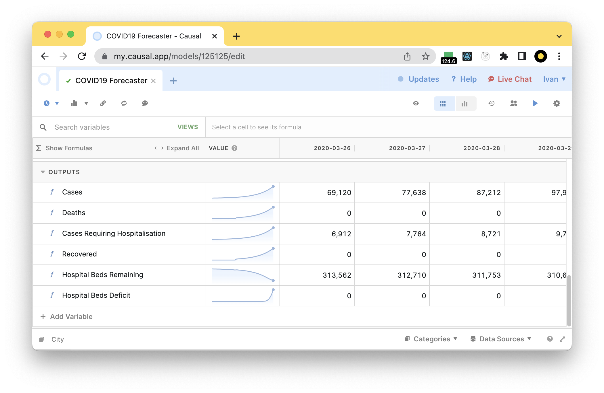

Sometimes, Causal models get huge, which raises challenges in keeping them fast. One of these challenges is UI interactions. For example, in a huge model, if you opened the Categories pane and tried to fill several values in a row, you’d notice how the UI gets pretty laggy:


Here’s how PerfPerfPerf helped Causal to speed up this interaction by almost 4× – with nearly every optimization changing just a few lines.

```toc
# This code block gets replaced with the TOC
header: Contents
```

# Profiling The Interaction

To optimize the interaction, we need to figure out what makes it slow. My go-to tool for that is Chrome DevTools:

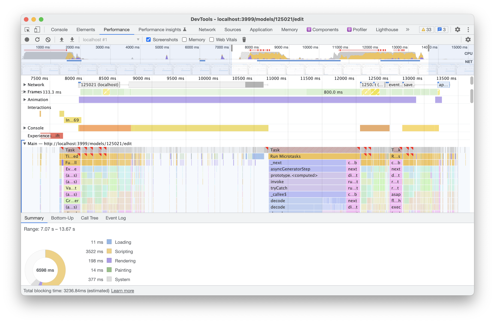

There’s a lot of stuff in the recording, so it might be confusing if you’re seeing it for the first time. But that’s okay! What we need to pay attention to is just two areas:

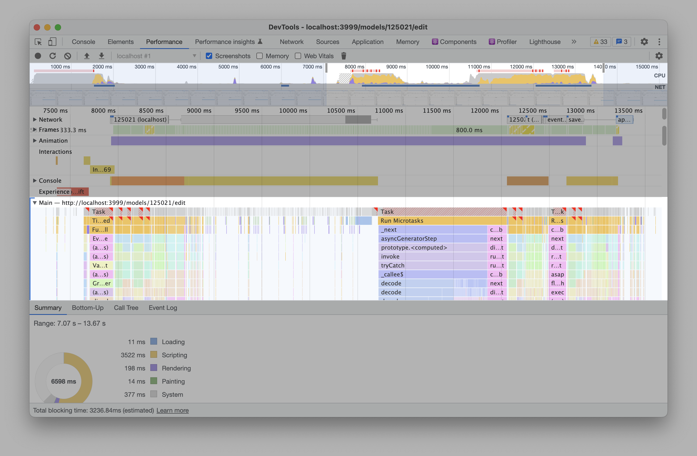

So what’s going on here? If you go through the recording and click through a bunch of rectangles, you’ll notice some patterns:

- **There are a lot of React renders.** Specifically, every rectangle called `performSyncWorkOnRoot` is (roughly) a function that starts a React render cycle. And there are lots of them (precisely, 1325):

  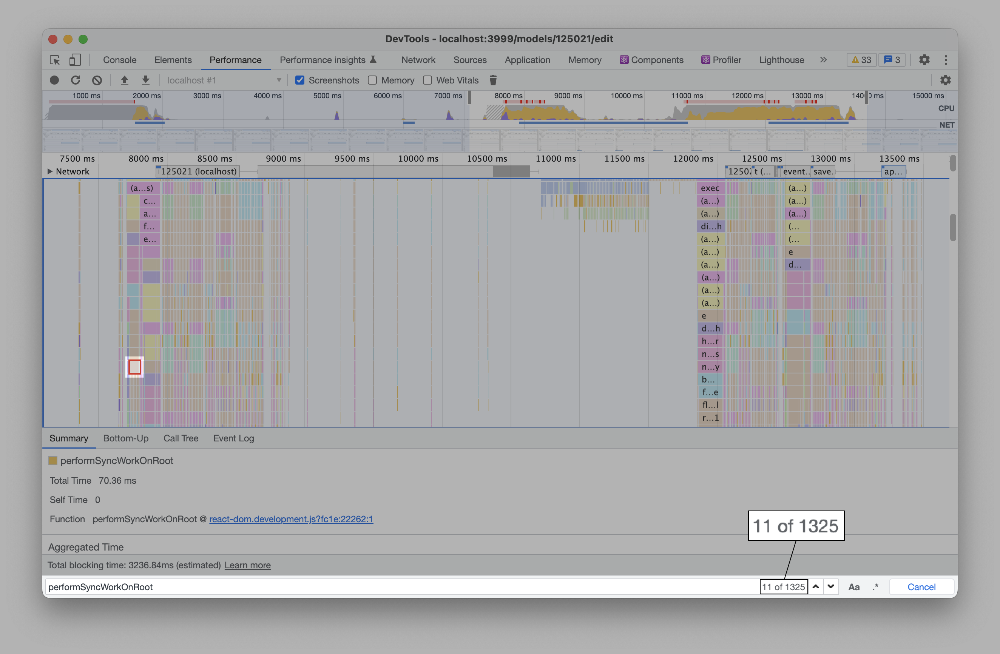

- **Most of these React renders are caused by AG Grid.** [AG Grid](https://www.ag-grid.com/) is a library that Causal uses to render tables/grids:

  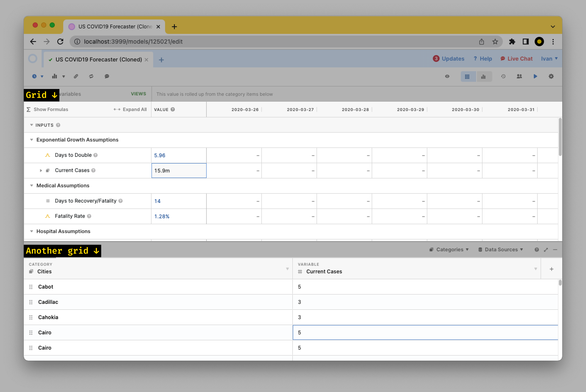

  If you find any `performSyncWorkOnRoot` rectangle and then scroll up, you’ll see what caused that function to run (meaning, caused that React render). Most of the time, that will be some AG Grid code:

  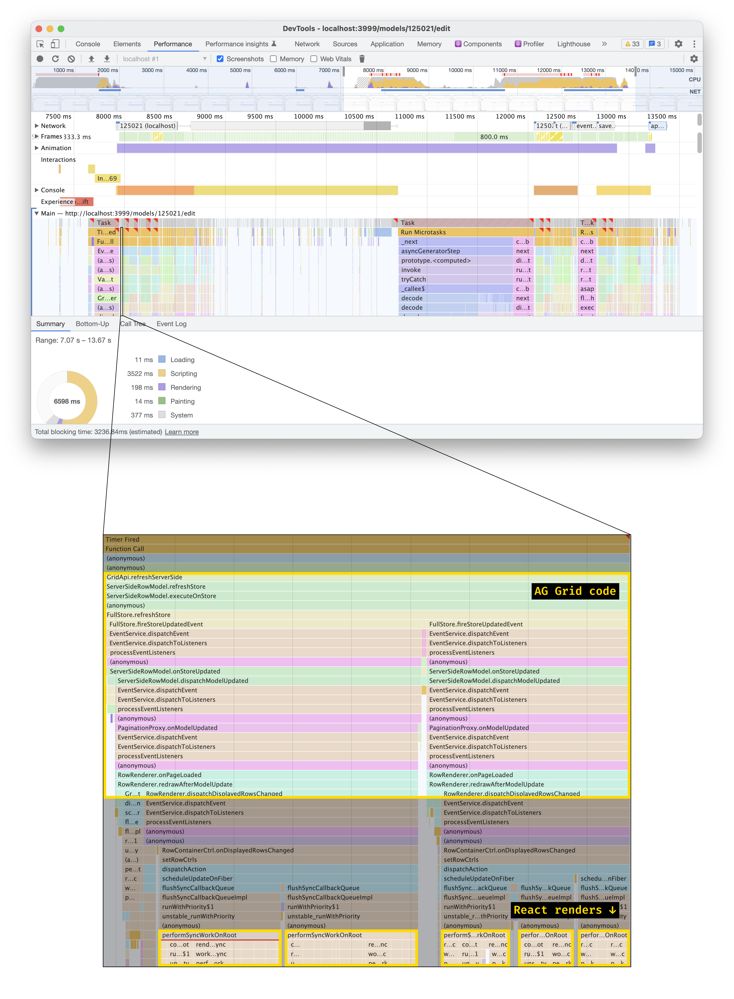

- **Some of the code runs several times.** E.g., at the beginning of the recording, we call `GridApi.refreshServerSide` and `GridApi.refreshCells` two times in a row:

  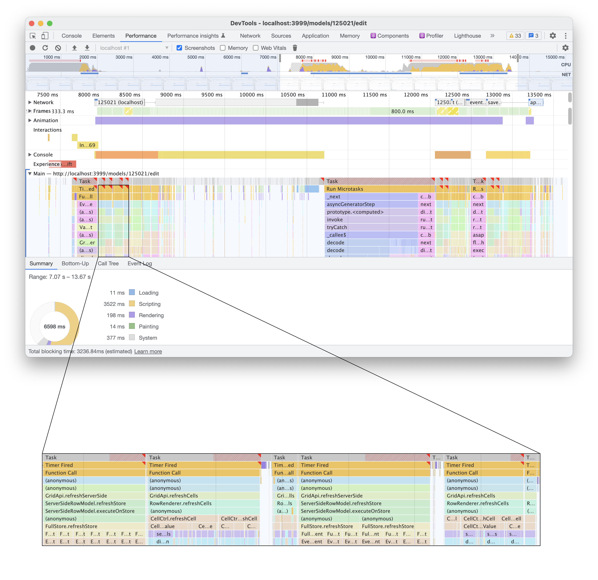

  Later, some code seems to call `getRows` over and over and over again:

  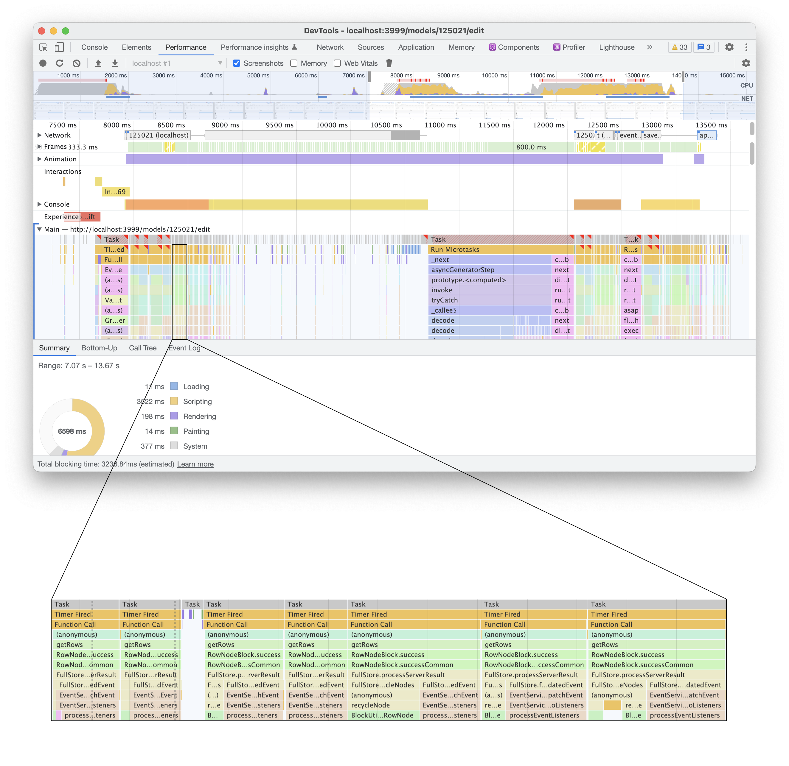

  This is good! When we have some code that runs ten times in a row, we can improve a single run – and get a 10× improvement. And if some of these runs end up being unnecessary, we’ll be able to remove them altogether.

Let’s dive in.

# AG Grid: Fixing An Extra Render

Across the recording, four chunks of JavaScript start with `GridApi.refreshServerSide`:

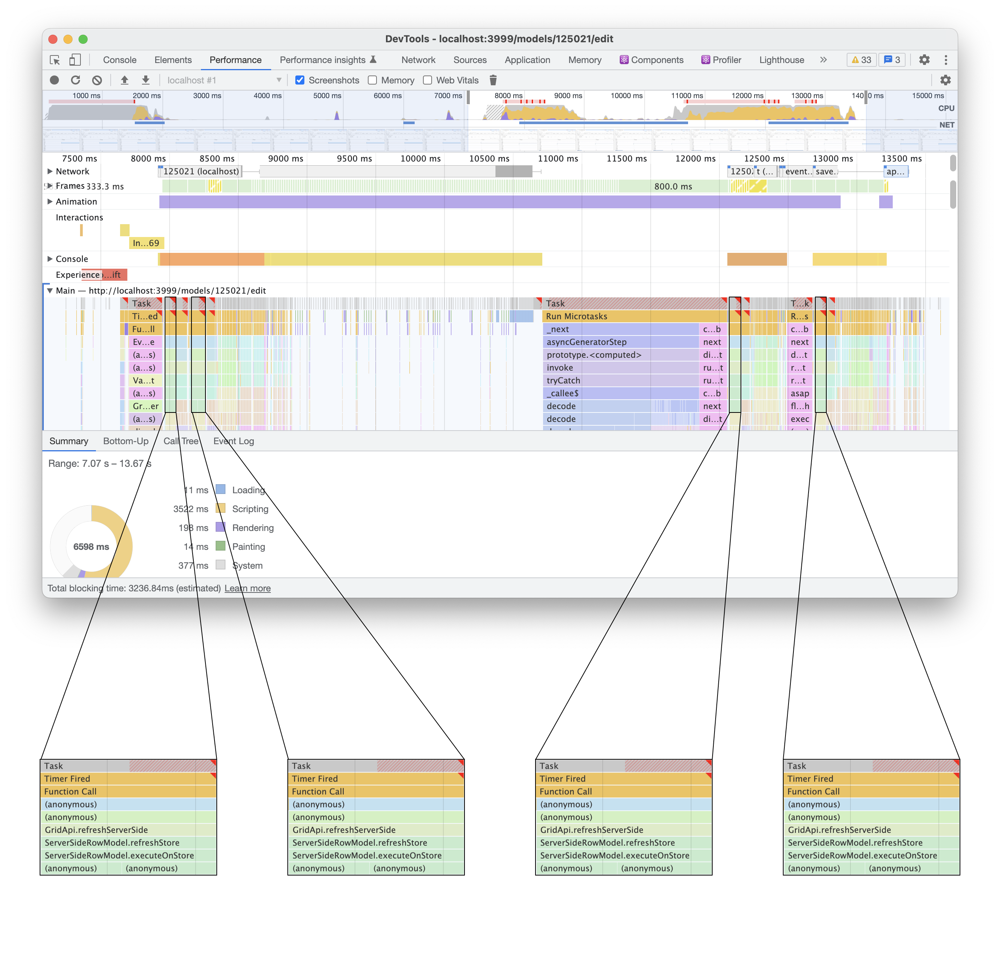

:::sidenote[Hunting for component names works because to render a functional component, React just calls it. (For class components, React calls the `.render()` method.)]
Down the flame chart, these chunks of JavaScript cause many React rerenders. To figure out which components are being rendered, let’s scroll down and hunt for component names.
:::

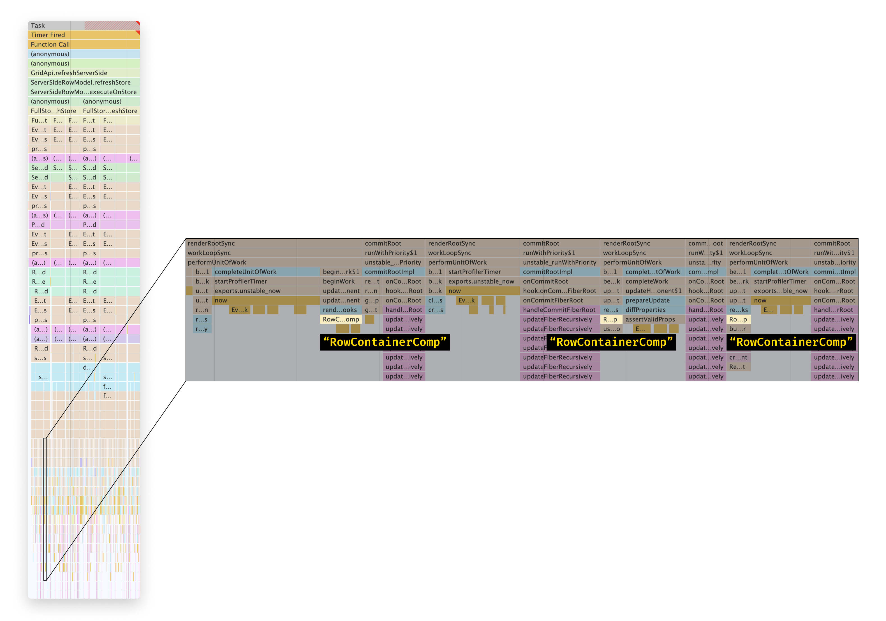

:::note
**Why not use React Profiler?** Another way to see which components are rendered is to record a trace [in React Profiler](https://chrome.google.com/webstore/detail/react-developer-tools/fmkadmapgofadopljbjfkapdkoienihi?hl=en). However, when you have a lot of rerenders, matching that trace with the DevTools Performance trace is hard – and if you make a mistake, you’ll end up optimizing the wrong rerenders.
:::

If you click through the component names in the recording, you’ll realize every component is `RowContainerComp`. This is [a component from AG Grid](https://github.com/ag-grid/ag-grid/blob/760be3ac7b86716780f58645e8113720f2f63bc2/community-modules/react/src/reactUi/rows/rowContainerComp.tsx):

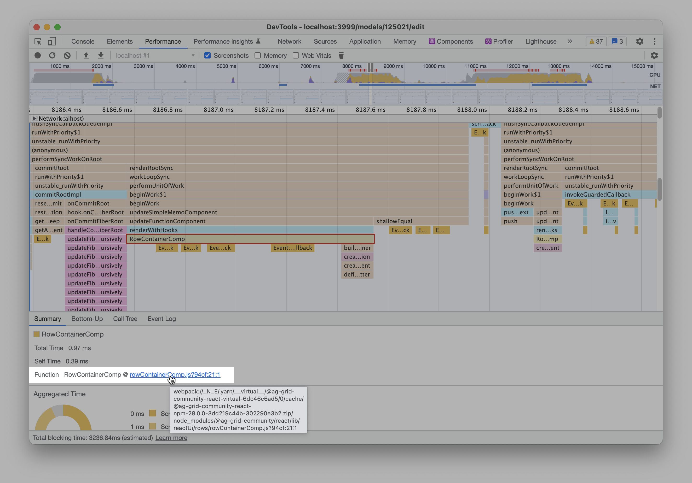

Why do these components render? To answer that, let’s [switch to React Profiler](https://twitter.com/iamakulov/status/1417122098267312133) and find these components there:


:::note
**Why use React Profiler this time?** This time, we _are_ using React Profiler. We’ve learned the component names, so we don’t need to match the trace with the DevTools performance pane anymore.

Other ways to learn why a component rerenders are [why-did-you-render](https://github.com/welldone-software/why-did-you-render) and [useWhyDidYouUpdate](https://usehooks.com/useWhyDidYouUpdate/). They work great with first-party code but are harder to configure for third-party one (like AG Grid components).
:::

As we see, `RowContainerComp` components rerender because their hook 2 changed. To find that hook, let’s switch from the Profiler to the Components pane – and match component hooks [with the source code](https://github.com/ag-grid/ag-grid/blob/760be3ac7b86716780f58645e8113720f2f63bc2/community-modules/react/src/reactUi/rows/rowContainerComp.tsx):

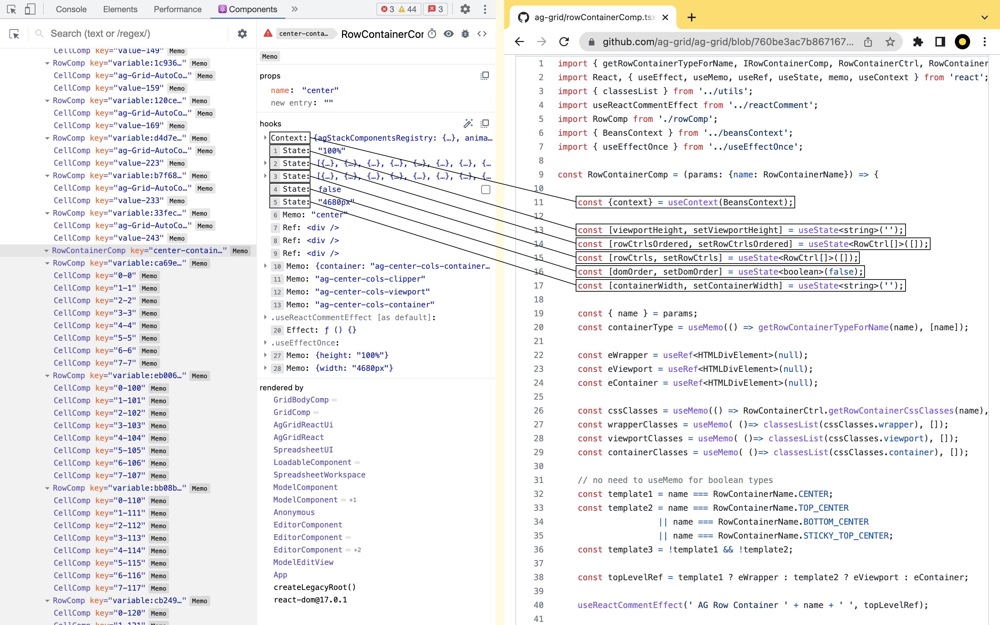

Hook no. 2 is this:

```ts
const [rowCtrlsOrdered, setRowCtrlsOrdered] = useState<RowCtrl[]>([]);
```

:::note

**Why won’t we just count hooks in the source code?** That’s the most obvious approach, but it rarely works. That’s because:

- React skips `useContext` when counting hooks. (This is probably because `useContext` [is implemented differently from other hooks](https://twitter.com/acdlite/status/1586779571290275840).)

- React doesn’t keep track of custom hooks. Instead, it counts every built-in hook inside a custom hook (except `useContext`). For example, if a component calls [`useSelector` from Redux](https://react-redux.js.org/api/hooks#useselector), and `useSelector` uses four React hooks inside, React profiler might show you “Hook 3 changed.”

:::

So, we figured out that our interaction renders a bunch of `RowContainerComp` components from AG Grid. These components rerender because their hooks no. 2 (the `rowCtrlsOrdered` state) change. Now, if you look through the component’s source code, you’ll notice that `rowCtrlsOrdered` is updated inside a `useEffect`:

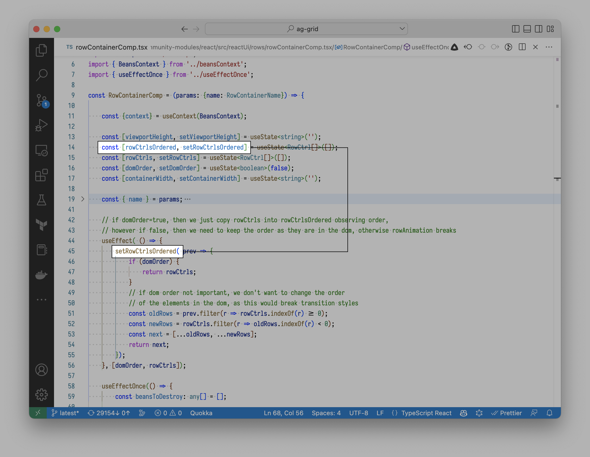

And that `useEffect` triggers when the `rowCtrls` or the `domOrder` state changes:

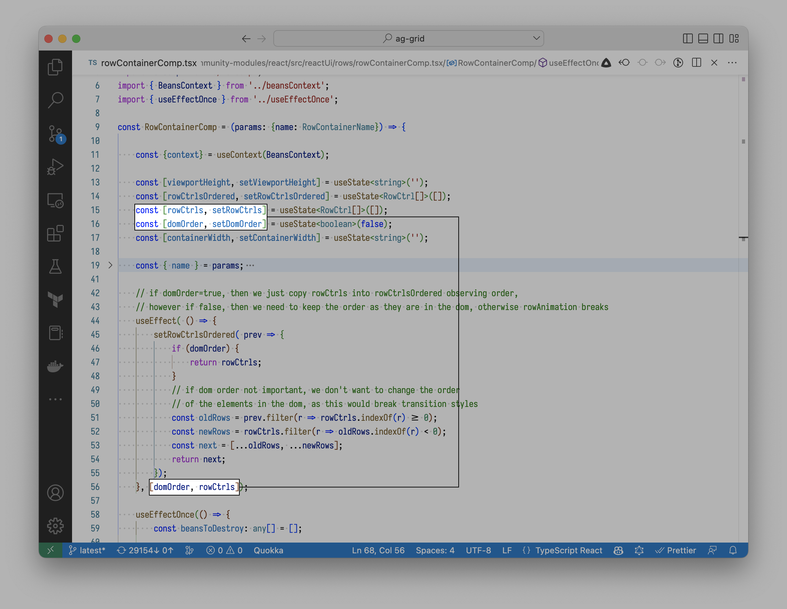

This is not optimal! AG Grid is setting state from inside a `useEffect`. This means it schedules a new update right after another one has happened. Here’s the entire order of events:

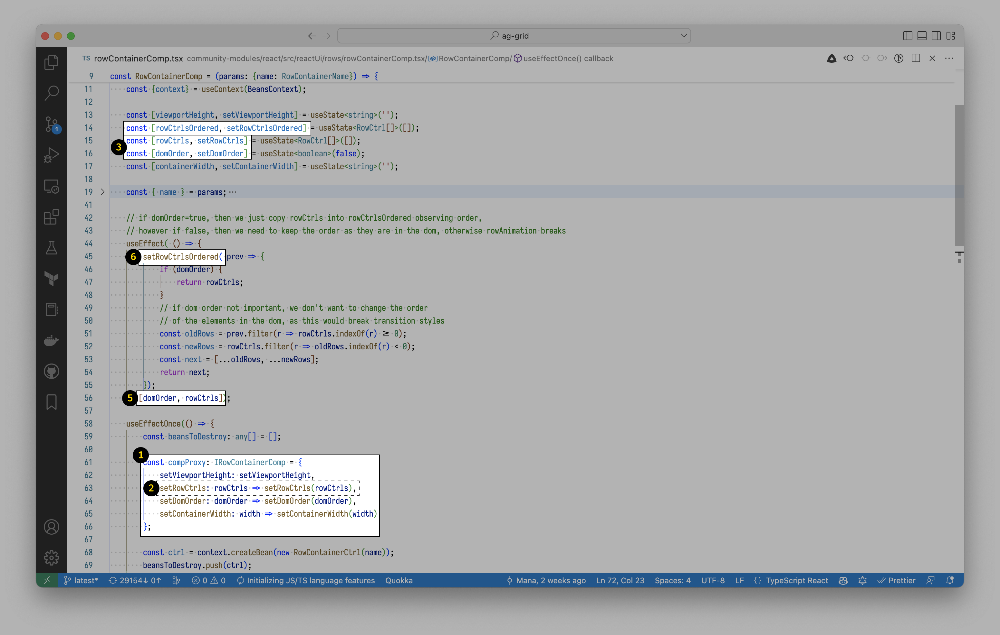

1. When the component mounts, it exposes several functions to the AG Grid core

2. Later, AG Grid calls `compProxy.setRowCtrls`

3. `compProxy.setRowCtrls` updates the `rowCtrls` state

4. Because the state changed, the component rerenders 💥

5. The `rowCtrls` state got updated, so React runs `useEffect`

6. Inside `useEffect`, React updates the `rowCtrlsOrdered` state

7. Because the state changed, the component rerenders again 💥

We’re rerendering (💥) the component twice just to update hook no. 2! This isn’t great. If AG Grid updated `rowCtrlsOrdered` immediately at step 2 instead of 5, we’d be able to avoid an extra render.

:::sidenote[With npm, [`patch-package`](https://www.npmjs.com/package/patch-package) works just as well.]
So why don’t we make AG Grid do this? Using [`yarn patch`](https://yarnpkg.com/cli/patch), let’s patch the `@ag-grid-community/react` package to eliminate the extra render:
:::

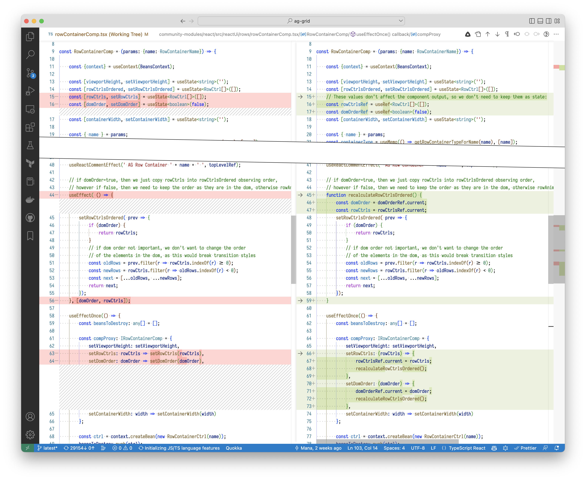

This alone cuts the number of rerenders in half – and, because `RowContainerComp` is rendered outside `GridApi.refreshServerSide()` calls too, shaves off around 15-20% of the execution time.

But we’re not done with AG Grid yet.

# AG Grid: Removing The Renders

The `RowContainerComp` components are containers for different parts of the grid:

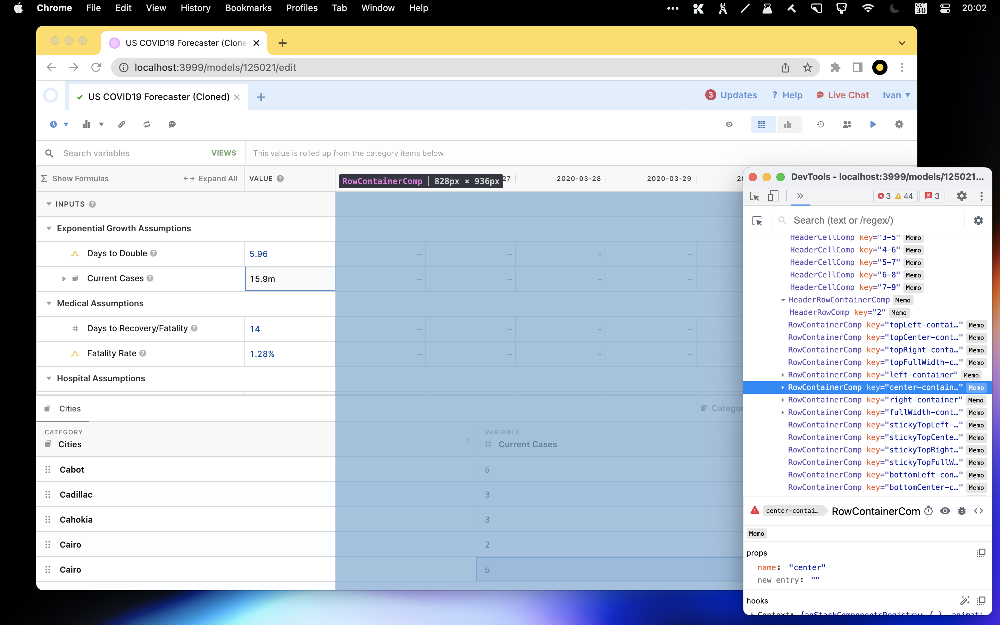

These components render every time we type into the editor. We just removed half of these renders. But there’s still another half, and it’s probably unnecessary – as nothing in these components changes visually.

What’s causing these renders? As we learned in the previous section, `RowContainerComp`s rerender when AG Grid calls `compProxy.setRowCtrls`. In every call, AG Grid passes a new `rowCtrls` array. Let’s add [a logpoint](https://developer.chrome.com/blog/new-in-devtools-73/#logpoints) to see how the array looks:

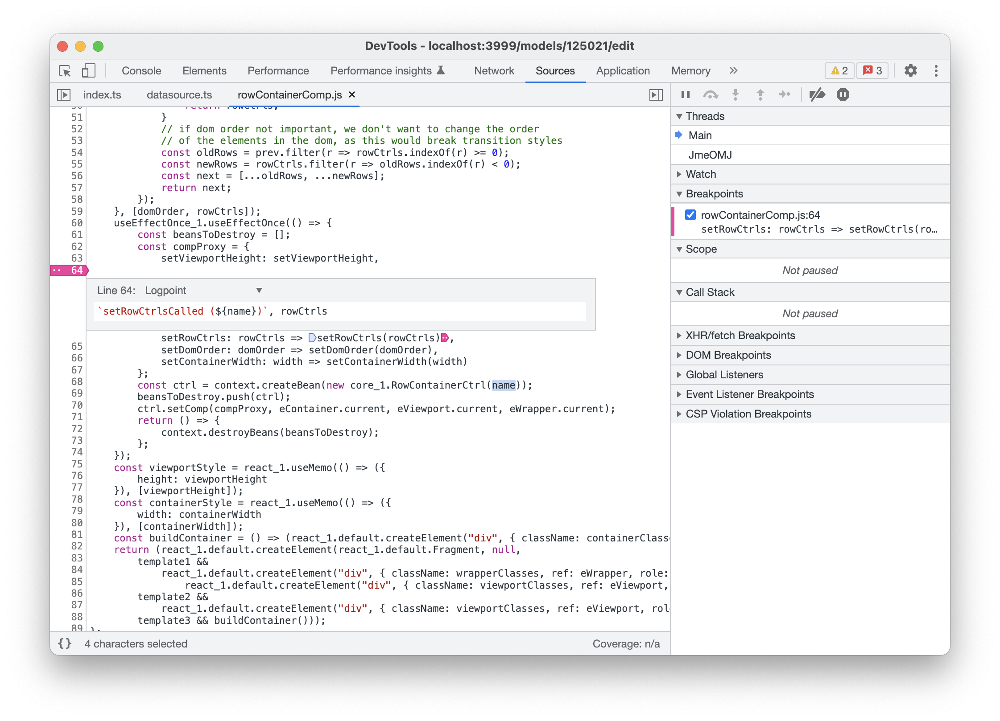

and check the console output:

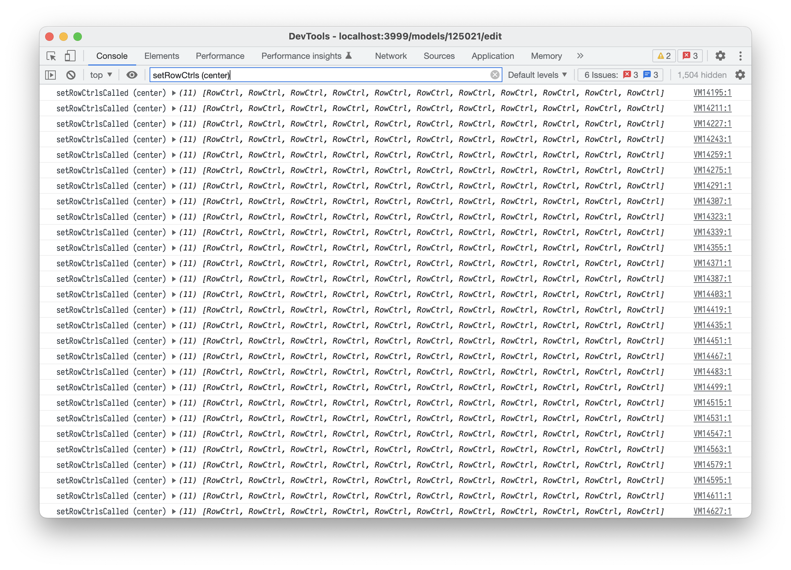

Woah, doesn’t every log look the same?

And indeed. If you debug this a bit, you’ll realize that:

- the array that’s logged is always different (this is because AG Grid [is re-creating it with `.filter()`](https://github.com/ag-grid/ag-grid/blob/760be3ac7b86716780f58645e8113720f2f63bc2/community-modules/core/src/ts/gridBodyComp/rowContainer/rowContainerCtrl.ts#L397-L399) before passing it in)
- however, all items in that array are identical (`===`) across rerenders

Inside the component, AG Grid never touches the array – it only maps its items. So, if the array items don’t change, why should the component rerender?

We can prevent this extra render by adding a shallow equality check:

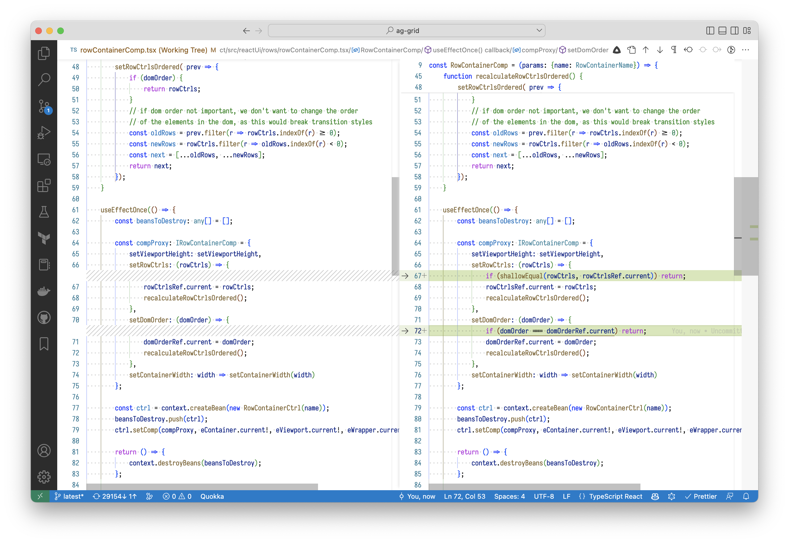

This saves a lot of time. Because on every cell update, `RowContainerComp` components rerender 1568 times (!), eliminating all renders cuts off _another_ 15-30% of the total JS cost.

# Running `useEffect` Less Often

Here are a few other parts of the recording:

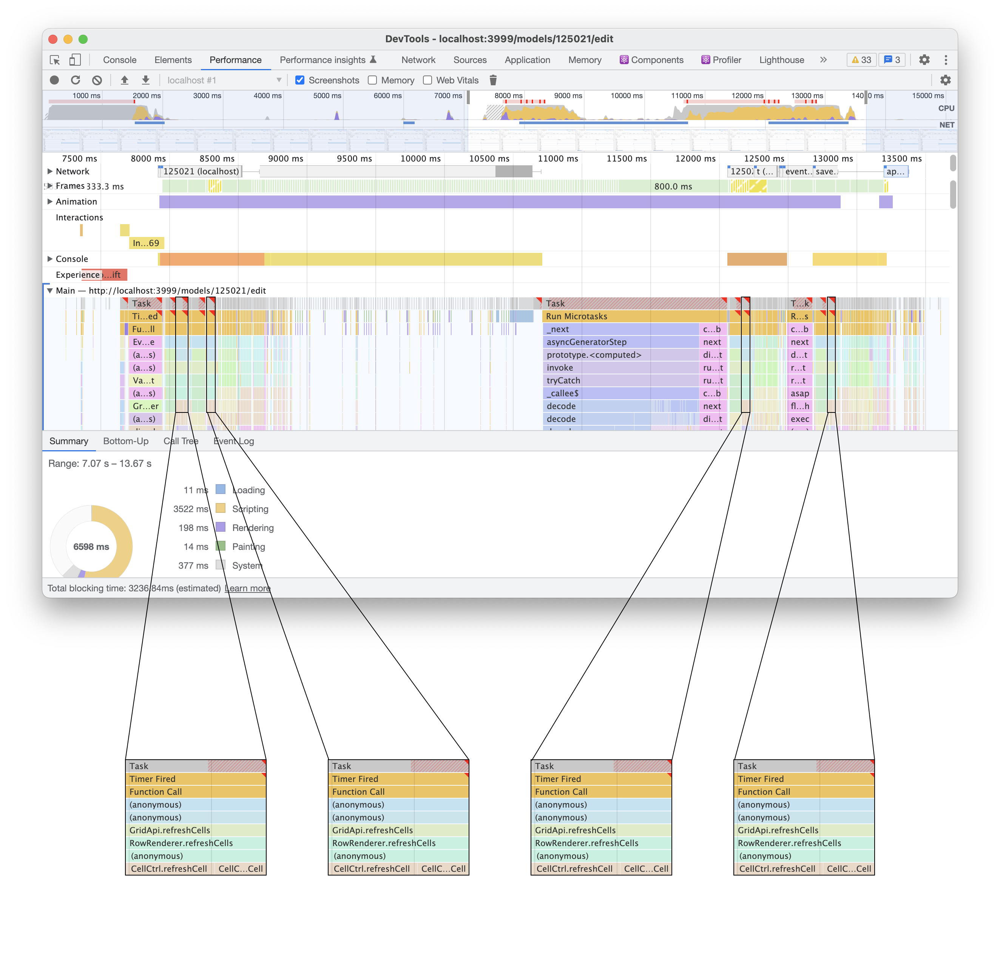

In these parts, we call a function called `gridApi.refreshCells()`. This function gets called four times and, in total, takes around 5-10% of the JavaScript cost.

Here’s the Causal code that calls `gridApi.refreshCells()`:

```php
// ⚠️ Hacky:
// Hard refresh if autocomplete changes.
// This works around issue #XXX in the ShowFormulas view
useEffect(() => {
  setTimeout(() => {
    // Note: we're scheduling refreshCells() in a new task.
    // This ensures all previous AG Grid updates have time to propagate
    gridApi.refreshCells({ force: true });
  }, 0);
}, [gridApi, autocompleteVariables]);
```

This is an unfortunate hack (one of the few which every codebase has) that works around an issue with code editor autocomplete occasionally not picking up new variables.

The workaround is supposed to run every time a new variable gets added or removed. However, currently, it runs way more frequently. That’s because `autocompleteVariables` is a deeply nested object with a bunch of other information about variables, including their values:

```php
// The `autocompleteVariables` object (simplified)
{
  "variable-id": {
    name: "myVariable",
    type: "Variable",
    dimensions: [...],
    model: ...,
  },
  ...
}
```

When you type in the cell, a few variables update their values. That causes `autocompleteVariables` to update – and triggers a `gridApi.refreshCells()` call. These calls are unnecessary – `gridApi.refreshCells()` only needs to run when a new variable is added or removed. How can we achieve this?

- A naive way to do that would be to rewrite `useEffect` dependencies like this:

  ```tsx
  useEffect(() => {
    // ...
  }, [gridApi, autocompleteVariables]);
  ```

  ↓

  ```tsx
  useEffect(() => {
    // ...
  }, [gridApi, autocompleteVariables.length]);
  ```

  This will work in most cases. However, if we add one variable and remove another one simultaneously, the workaround won’t run.

- A [proper way](https://www.youtube.com/watch?v=RW9TVhmxu6Q) to do that would be to move `gridApi.refreshCells()` to the code that adds or removes a variable – e.g., to a Redux saga that handles the corresponding action.

  However, this isn’t a simple change. The logic that uses `gridApi` is concentrated in a single component. Exposing `gridApi` to the Redux code would require us to break/change several abstractions. We’re working on this, but this will take time.

- Instead, while Causal is working on a proper solution, why don’t we hack a bit more? 😅

  ```tsx
  useEffect(() => {
    // ...
  }, [gridApi, autocompleteVariables]);
  ```

  ↓

  ```tsx
  useEffect(() => {
    // ...
  }, [gridApi, Object.keys(autocompleteVariables).sort().join(',')]);
  ```

  With this change, `useEffect` will depend only on concrete variable IDs inside `autocompleteVariables`. Unless any variable ids get added or removed, the `useEffect` shouldn’t run anymore. (This assumes none of the variable ids include a `,` character, which is true in Causal’s case.)

Terrible? Yes. Temporary, contained, and [easy to delete](https://programmingisterrible.com/post/139222674273/how-to-write-disposable-code-in-large-systems), bearing the minimal technical debt? Also yes. Solves the real issue? Absolutely yes. The real world is about tradeoffs, and sometimes you have to write less-than-optimal code if it makes your users’ life better.

Just like that, we save another 5-10% of the JavaScript execution time.

# Deep `areEqual`

There are a few bits in the performance trace that look like this:

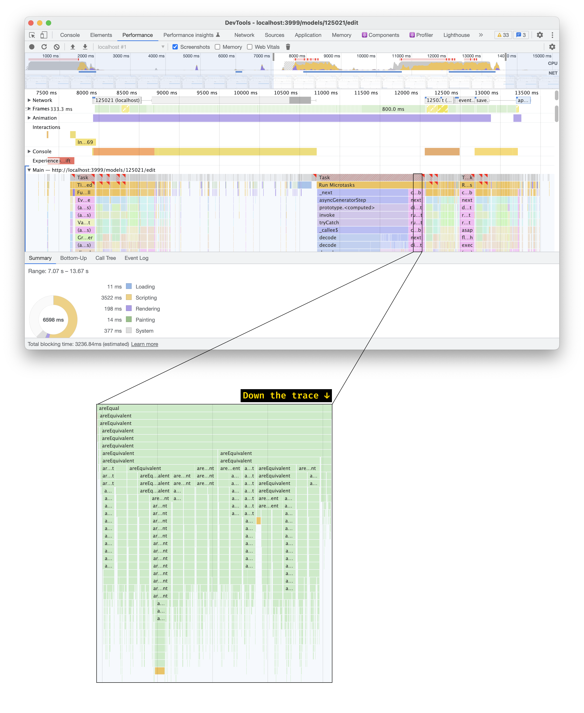

What happens here is we have a function called `areEqual`. This function calls a function called `areEquivalent` – and then `areEquivalent` calls itself multiple times, over and over again. This is a deep equality comparison, and on a 2020 MacBook Pro, it takes ~90 ms.

The `areEqual` function [comes from AG Grid](https://github.com/ag-grid/ag-grid/blob/fa0f9a4befe0486ebfb232a257eba2e6fb1e7b23/community-modules/react/src/shared/changeDetectionService.ts#L24-L26). Here’s how it’s called:

1. React [calls `componentDidUpdate()`](https://github.com/ag-grid/ag-grid/blob/3ba94de74e5e3a7adc3aaa1a476e867f8f550fac/community-modules/react/src/reactUi/agGridReactUi.tsx#L133-L135) in AG Grid whenever the component rerenders:

   ```tsx
   class AgGridReactUi {
     componentDidUpdate(prevProps) {
       this.processPropsChanges(prevProps, this.props);
     }
   }
   ```

2. `componentDidUpdate()` invokes [`processPropChanges()`](https://github.com/ag-grid/ag-grid/blob/3ba94de74e5e3a7adc3aaa1a476e867f8f550fac/community-modules/react/src/reactUi/agGridReactUi.tsx#L137-L144):

   ```tsx
   public processPropsChanges(prevProps: any, nextProps: any) {
       const changes = {};

       this.extractGridPropertyChanges(prevProps, nextProps, changes);
       this.extractDeclarativeColDefChanges(nextProps, changes);

       this.processChanges(changes);
   }
   ```

3. Among other things, `processPropChanges()` calls a function called [`extractGridPropertyChanges()`](https://github.com/ag-grid/ag-grid/blob/3ba94de74e5e3a7adc3aaa1a476e867f8f550fac/community-modules/react/src/reactUi/agGridReactUi.tsx#L181-L199)

4. `extractGridPropertyChanges()` then performs a deep comparison on every prop passed into `AgGridReactUi`:

   ```tsx
   // The code is simplified
   private extractGridPropertyChanges(prevProps: any, nextProps: any, changes: any) {
       Object.keys(nextProps).forEach(propKey => {
           if (_.includes(ComponentUtil.ALL_PROPERTIES, propKey)) {
               const changeDetectionStrategy = this.changeDetectionService.getStrategy(this.getStrategyTypeForProp(propKey));

               // ↓ Here
               if (!changeDetectionStrategy.areEqual(prevProps[propKey], nextProps[propKey])) {
                   // ...
               }
           }
       });
   ```

   If some of these props are huge and change significantly, the deep comparison will take a lot of time. Unfortunately, this is precisely what’s happening here.

With a bit of debugging and [`console.time()`](https://developer.mozilla.org/en-US/docs/Web/API/Console/time), we find out that the expensive prop is `context`. `context` is an object holding a bunch of variables that we need to pass down to grid components. The object changes for good:

```tsx
const context: GridContext = useMemo(
  (): GridContext => ({
    allDimensions,
    autocompleteVariables,
    // ↓ A few values in the model change (as they should).
    // This rebuilds the `editorModel` – and the `context` object itself
    editorModel,
    filteredDimensions,
    isReadOnly,
    modelId,
    scenarioId: activeScenario.id,
    showFormulas,
  }),
  [
    activeScenario.id,
    allDimensions,
    autocompleteVariables,
    editorModel,
    filteredDimensions,
    isReadOnly,
    modelId,
    showFormulas,
  ],
);
```

However, using a deep comparison on such a massive object is bad and unnecessary. The object is memoized, so we can just `===` it to figure out whether it changed. But how do we do that?

AG Grid supports [several comparison strategies for props](https://github.com/ag-grid/ag-grid/blob/fa0f9a4befe0486ebfb232a257eba2e6fb1e7b23/community-modules/react/src/shared/changeDetectionService.ts#L1-L5). One of them implements a `===` comparison:

```tsx
export enum ChangeDetectionStrategyType {
  IdentityCheck = 'IdentityCheck', // Uses === to compare objects
  DeepValueCheck = 'DeepValueCheck', // Uses deep comparison to compare objects
  NoCheck = 'NoCheck', // Always considers objects different
}
```

However, based on the source code, we can specify a custom strategy [only for the `rowData` prop](https://github.com/ag-grid/ag-grid/blob/fa0f9a4befe0486ebfb232a257eba2e6fb1e7b23/community-modules/react/src/reactUi/agGridReactUi.tsx#L231-L243):

```tsx
// This function chooses how to compare any given prop
getStrategyTypeForProp(propKey) {
  if (propKey === 'rowData') {
    if (this.props.rowDataChangeDetectionStrategy) {
      return this.props.rowDataChangeDetectionStrategy;
    }
    // ...
  }

  return ChangeDetectionStrategyType.DeepValueCheck;
}
```

But nothing is preventing us from patching AG Grid again, right? Using [yarn patch](https://yarnpkg.com/cli/patch/), [like we did above](#ag-grid-fixing-an-extra-render), let’s add a few lines into the `getStrategyTypeForProp()` function:

```tsx
getStrategyTypeForProp(propKey) {
  // NEW
  if (this.props.changeDetectionStrategies && propKey in this.props.changeDetectionStrategies) {
    return this.props.changeDetectionStrategies[propKey];
  }
  // END OF NEW

  if (propKey === 'rowData') {
    if (this.props.rowDataChangeDetectionStrategy) {
      return this.props.rowDataChangeDetectionStrategy;
    }
    // ...
  }

  // all other cases will default to DeepValueCheck
  return ChangeDetectionStrategyType.DeepValueCheck;
}
```

With this change, we can specify a custom comparison strategy for the `context` prop:

```tsx
import { ChangeDetectionStrategyType } from "@ag-grid-community/react/lib/shared/changeDetectionService";

// ...

<AgGridReact
  changeDetectionStrategies={{
    context: ChangeDetectionStrategyType.IdentityCheck
  }}
  // ...
>
```

And, just like that, we save another 3-5% of the JavaScript cost.

# What’s Still In The Works

## More Granular Updates

You might’ve noticed that for one update of a category value, we rerender the data grid four times:

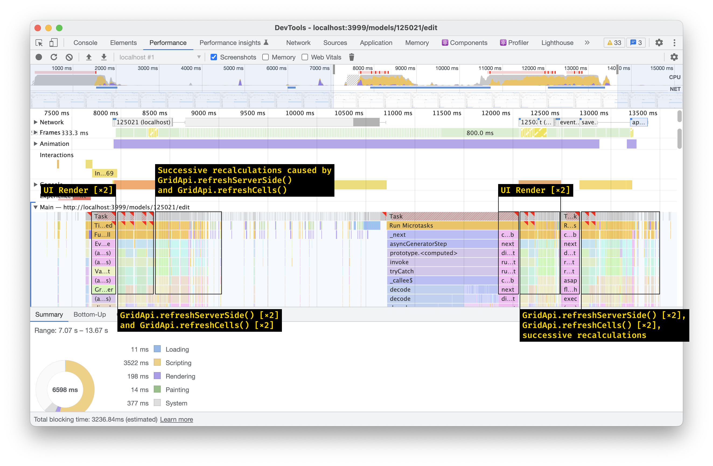

Four renders are three renders too many. The UI should update only once if a user makes a single change. However, solving this is challenging.

Here’s a `useEffect` that rerenders the data grid:

```tsx
useEffect(() => {
  const pathsToRefresh: { route: RowId[] }[] = [];
  for (const [pathString, oldRows] of rowCache.current.entries()) {
    // Fill the pathsToRefresh object (code omitted)
  }

  for (const refreshParams of pathsToRefresh) {
    gridApi?.refreshServerSide(refreshParams);
  }
}, [
  editorModel,
  gridApi,
  variableDimensionsLookup,
  activeScenario,
  variableGetterRef,
]);
```

To figure out what’s causing this `useEffect` to re-run, let’s use [`useWhyDidYouUpdate`](https://usehooks.com/useWhyDidYouUpdate/):

```tsx
useEffect(() => {
  // ...
}, [
  editorModel,
  gridApi,
  variableDimensionsLookup,
  activeScenario,
  variableGetterRef,
]);

useWhyDidYouUpdate('datasource', {
  editorModel,
  gridApi,
  variableDimensionsLookup,
  activeScenario,
  variableGetterRef,
});
```

`useWhyDidYouUpdate` will print this:

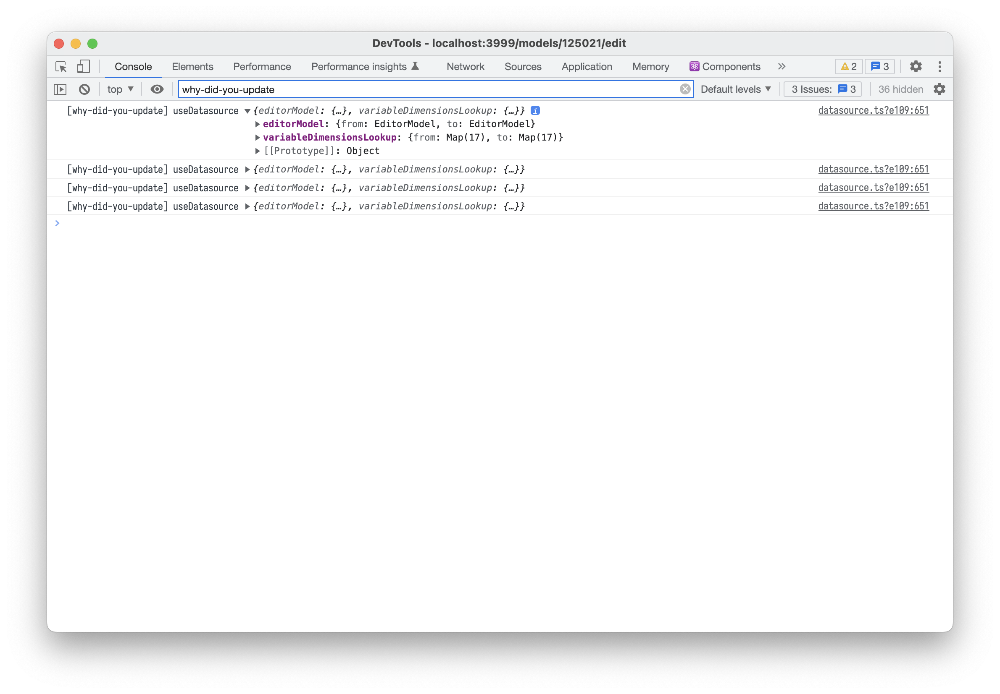

This tells us `useEffect` re-runs because `editorModel` and `variableDimensionsLookup` objects change. But how? With [a little custom `deepCompare` function](https://gist.github.com/iamakulov/5f1e74cdcffc8a0bb3d2278dd54d8328), we can figure this out:

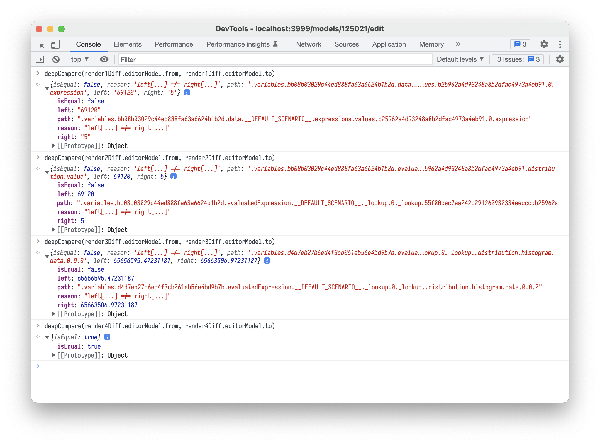

This is how `editorModel` changes if you update a single category value from `69120` to `5`. As you see, a single change causes four consecutive updates. `variableDimensionsLookup` changes similarly (not shown)

One category update causes four `editorModel` updates. Some of these updates are caused by suboptimal Redux sagas (which we’re fixing). Others (like update 4, which rebuilds the model but doesn’t change anything) may be fixed by adding extra [memoized selectors](https://github.com/reduxjs/reselect) or comparison checks.

But there’s also a deeper, fundamental issue that is harder to fix. With React and Redux, the code we write by default _is not performant_. React and Redux don’t help us to fall [into a pit of success](https://blog.codinghorror.com/falling-into-the-pit-of-success/).

To make the code fast, we need to remember to memoize most computations – both in components (with `useMemo` and `useCallback`) and in Redux selectors (with `reselect`). If we don’t do that, some components will rerender unnecessarily. That’s cheap in smaller apps but scales really, really poorly as your app grows.

And some of these computations are not really memoizable:

```tsx
const variableValues = useMemo(() => {
  return Object.values(editorModel.variables).map((variable) => variable.value);
}, [editorModel.variables]);
// ↑ Recalculates on every `editorModel.variables` change.
// But how do you recalculate it only when `editorModel.variables[...].value`s change?
// ("Deep comparison" is a possible answer, but it's very expensive with large objects.)
```

This also affects the `useEffect` we saw above:

```tsx
useEffect(() => {
  // Re-render the data grid
}, [editorModel /* ... */]);
// ↑ Re-runs on every `editorModel` change
// But how do you express "re-run it only when `editorModel.variables[...].value`s change"?
```

We’ve identified this improvement with Causal, and Causal is currently working on solving these extra renders (e.g., by [moving logic away from `useEffect`s](https://www.youtube.com/watch?v=RW9TVhmxu6Q)). In our tests, this should cut another 10-30% off the JavaScript cost. But this will take some time.

:::note
**React Forget.** To be fair, React is also working on [an auto-memoizing compiler](https://reactjs.org/blog/2022/06/15/react-labs-what-we-have-been-working-on-june-2022.html#react-compiler) which should reduce recalculations.
:::

## `useSelector` vs `useStore`

If you have some data in a Redux store, and you want to access that data in an `onChange` callback, how would you do that?

Here’s the most straightforward way:

```php
const CellWrapper = () => {
  const editorModel = useSelector(state => state.editorModel)
  const onChange = () => {
    // Do something with editorModel
  }

  return <Cell onChange={onChange} />
}
```

If `<Cell>` is expensive to rerender, and you want to avoid rerendering it unnecessarily, you might wrap `onChange` with `useCallback`:

```php
const CellWrapper = () => {
  const editorModel = useSelector(state => state.editorModel)
  const onChange = useCallback(() => {
    // Do something with editorModel
  }, [editorModel])

  return <Cell onChange={onChange} />
}
```

However, what will happen if `editorModel` changes very often? Right – `useCallback` will regenerate `onChange` whenever `editorModel` changes, and `<Cell>` will rerender every time.

Here’s an alternative approach that doesn’t have this issue:

```php
const CellWrapper = () => {
  const store = useStore()
  const onChange = useCallback(() => {
    const editorModel = store.getState().editorModel
    // Do something with editorModel
  }, [store])

  return <Cell onChange={onChange} />
}
```

This approach relies on Redux’s [`useStore()`](https://react-redux.js.org/api/hooks#usestore) hook.

- Unlike `useSelector()`, `useStore()` returns the full store object.

- Also, unlike `useSelector()`, `useStore()` can’t trigger a component render. But we don’t need to, either! The component output doesn’t rely on the `editorModel` state. Only the `onChange` callback needs it – and we can safely delay the `editorModel` read until then.

Causal has a bunch of components using `useCallback` and `useSelector` like above. They would benefit from this optimization, so Causal is gradually implementing it. We didn’t see any immediate improvements in the interaction we were optimizing, but we expect this to reduce rerenders in a few other places.

:::note
**`useEvent`.** In the future, wrapping the callback with [`useEvent`](https://github.com/reactjs/rfcs/pull/220) instead of `useCallback` might help solve this issue too.
:::

# What Didn’t Work

## Web Workers

Here’s another bit of the performance trace:

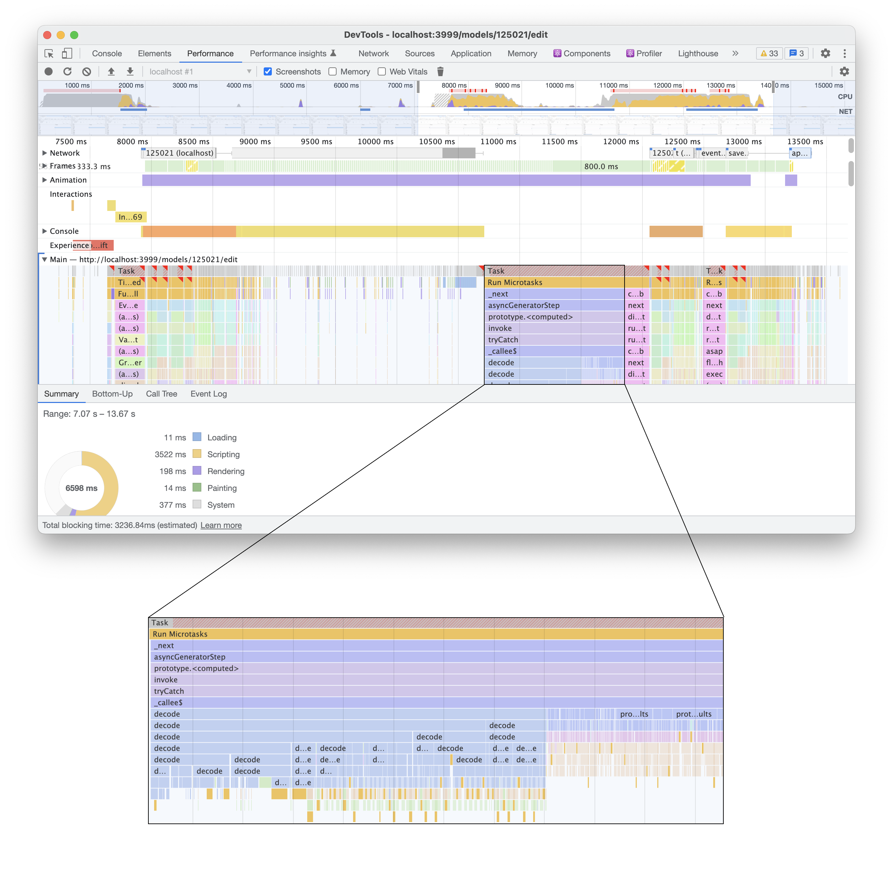

In this part of the trace, we receive a new binary-encoded model from the server and parse it using [protobuf](https://github.com/protobufjs/protobuf.js/). This is a self-contained operation (you call a single function, and it returns 400-800 ms later), and it doesn’t need to access DOM. This makes it a perfect candidate for a Web Worker.

:::note
**Web What?** [Web Workers](https://developer.mozilla.org/en-US/docs/Web/API/Web_Workers_API/Using_web_workers) are a way to run some expensive JavaScript in a separate thread. This allows to keep the page responsive while that JavaScript is running.
:::

The easiest way to move a function into a web worker is to wrap it with [comlink](https://github.com/GoogleChromeLabs/comlink):

```tsx
// index.ts

// Take this code:
import { decodeResponse } from 'causal-common/eval/proto/generated/eval_pb';
const response = decodeResponse(rawResponse);
```

↓

```typescript
// worker.ts

// Move it into a new file and wrap it with `Comlink.expose`:
import * as Comlink from 'comlink';
import { decodeResponse as decodeResponseImported } from 'causal-common/eval/proto/generated/eval_pb';

Comlink.expose({
  decodeResponse: (rawResponse) => {
    return decodeResponseImported(rawResponse);
  },
});
```

:::sidenote[The `new Worker()` syntax works [with webpack 5](https://webpack.js.org/guides/web-workers/), [Vite](https://vitejs.dev/guide/features.html#web-workers), and [will be supported in esbuild soon](https://github.com/evanw/esbuild/issues/312#issuecomment-1232418832).]

```tsx
// index.ts

// In the original file, create a worker...
import * as Comlink from 'comlink';
const worker = Comlink.wrap(
  new Worker(new URL('./worker.ts', import.meta.url)),
);

// And just prefix the original function call with `await worker.`
const response = await worker.decodeResponse(rawResponse);
```

:::

If we do that and record a new trace, we’ll discover that parsing was successfully moved to the worker thread:

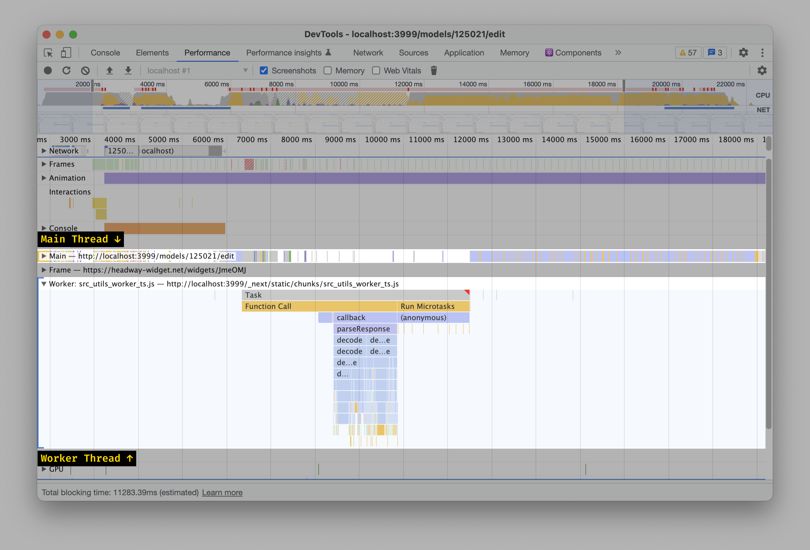

However, weirdly, the overall JS cost will increase. That’s because the main thread and the worker thread will add two new flat 400-6000ms long chunks of JavaScript:

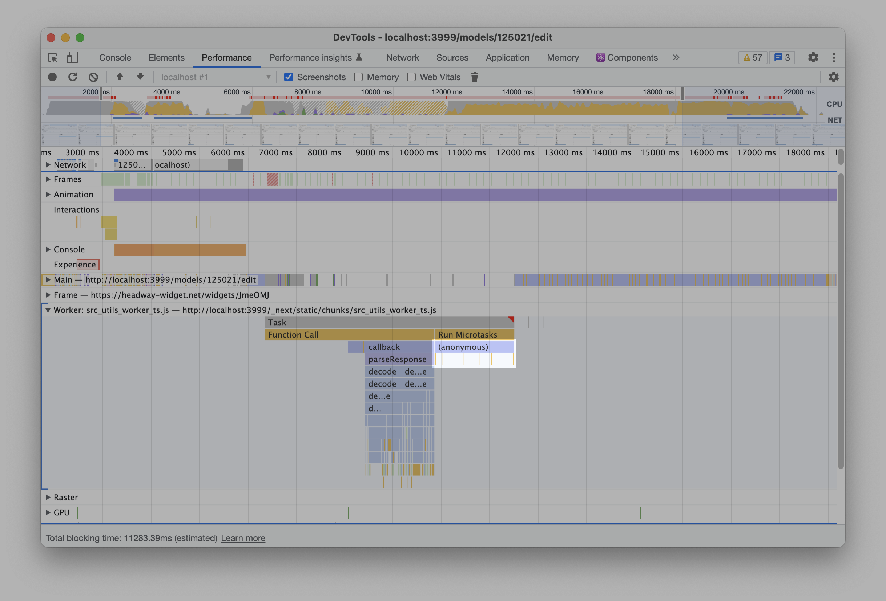

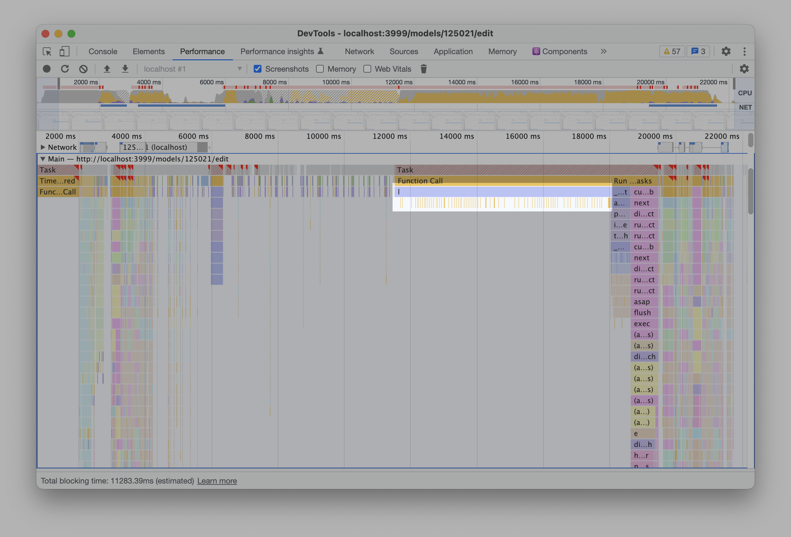

It turns out that moving stuff to a web worker isn’t free. Whenever you pass data from and to a web worker, the browser [has to serialize and deserialize it](https://developer.mozilla.org/en-US/docs/Web/API/Web_Workers_API/Structured_clone_algorithm). Typically, this is cheap; however, for large objects, this may take some time. For Causal, because the model was so large, this took longer than actually parsing the model!

Unfortunately, this optimization didn’t work for Causal. Instead, as an experiment, Causal has started working on selective data loading (fetching only visible rows instead of the whole model). In our tests, with selective data loading, the parsing costs go down from 500-1500 ms to 1-5 ms:

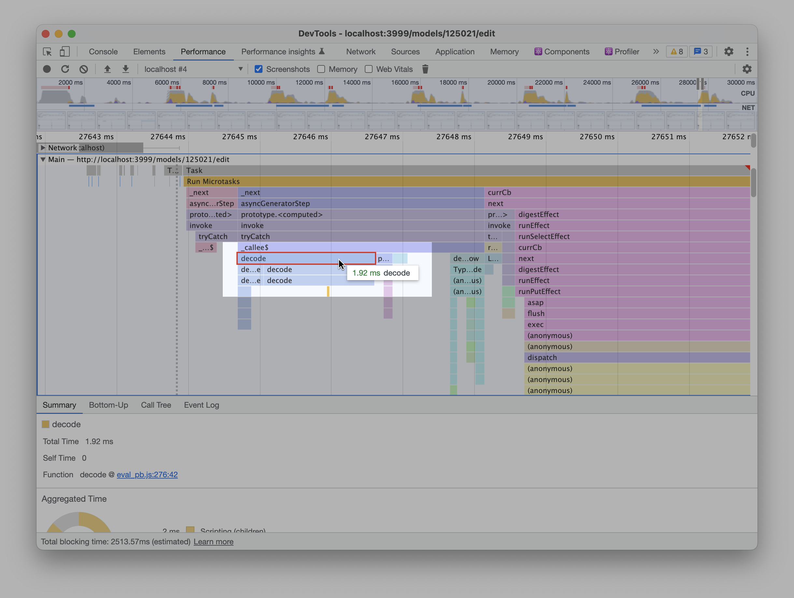

# Results

So, how much did these optimizations help? In our test model with ~100 categories, implementing the optimizations (and enabling selective data loading) reduces the JavaScript cost by almost four times 🤯

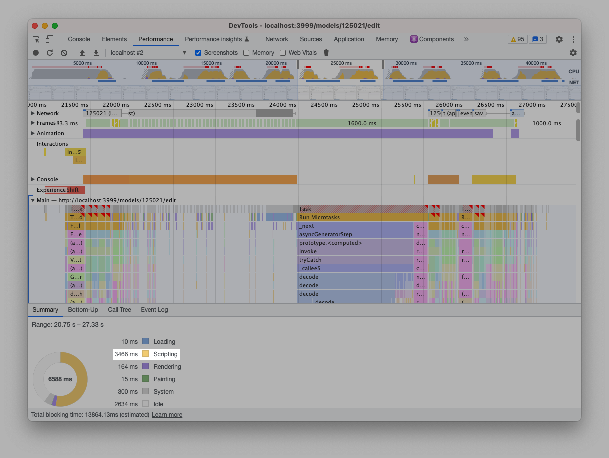

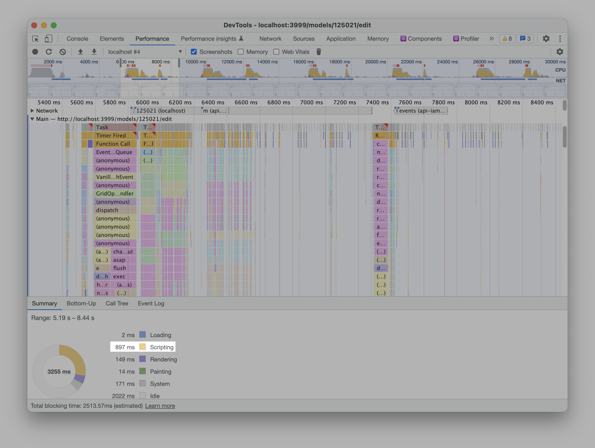

With these optimizations, updating category cells becomes a much smoother experience:


:::sidenote[Yellow/red = main thread is busy. Blue = main thread is free.]
We still have chunks of yellow/red in the recording, but they’re much smaller – and interwined with blue!
:::

_Cross-posted [to the Causal blog](https://www.causal.app/blog/react-perf)._
