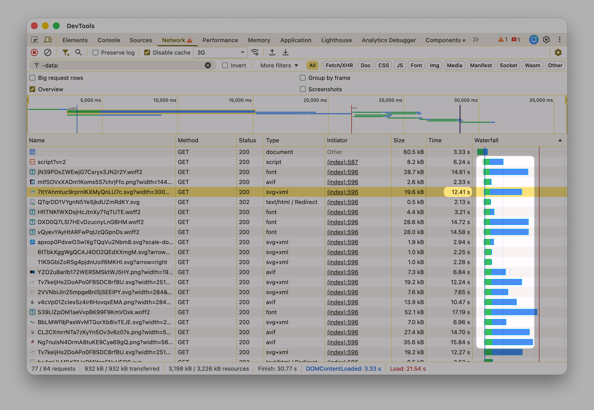
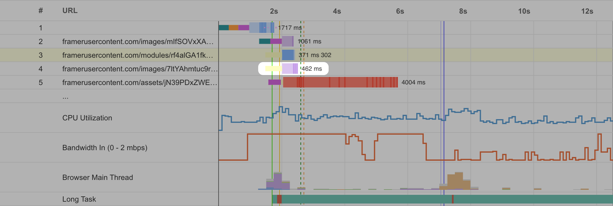

I had several cases this year where someone complained about things being slow in Chrome with network throttling, but a test on a real network didn’t reproduce that. Here’s the explanation for “why” so I can link to it in the future.

## 12-second hero image

A Framer client recently asked why a 20 kB hero image would take 12 seconds to load on a 3G connection. They attached a screenshot from Chrome DevTools:

:::sidenote[_Close-to-real?_ This test used [WebPageTest](https://www.webpagetest.org/), which is the gold standard for network testing.]
Upon investigation, it turned out that on a close-to-real 3G connection, the image would only take 300-500 ms to load:
:::

Why such a large difference? Well:

## Chrome Doesn’t Emulate A Slow Network Well

In the real world, the connection is usually slow for one of three reasons:

- _Bandwidth:_ This is what people usually mean when they say “network speed”. A network with low bandwidth (say, 3G with 780 kbps) can only let so many network packets through every second (~65, if each is 1500 bytes).
- _Latency:_ This is the delay between the server and the client. If each packet has to travel a long way (say, from the US to Australia), it will still take a while even when the network has enough bandwidth.
- _Packet loss:_ This is how many packets get lost on their way through the connection. If my `style.css` consists of 15 packets, but 4 of them get lost on the way to me, then the server has to re-send them again. Then, if one of those gets lost as well, the server has to re-send _that one_ again. All of this makes the file load slower.

:::note

**Packets? What the heck are packets?** When a server sends a file (like `style.css`) over the network, it splits it into several chunks, [attaches some metadata (“from: ..., to: ...”)](https://en.wikipedia.org/wiki/Transmission_Control_Protocol#TCP_segment_structure), and sends those chunks one by one. These chunks are called packets, and they’re the smallest primitive a network operates on. If you’re interested in how this all works, you should read [High Performance Browser Networking](https://hpbn.co/) by Ilya Grigorik.

:::

Notice how all of these reasons are about _packets_. Chrome DevTools throttling doesn’t work with packets. Instead, it works with requests. Even though it’s designed to mimic the real network, this leads to a lot of inaccuracies:

- Bandwidth is split across all requests equally. It’s common for servers to [prioritize some requests over others](https://blog.cloudflare.com/better-http-2-prioritization-for-a-faster-web/) – eg a more important image over a less important one – and send packets for the more important request first. DevTools throttling ignores that
- Stuff like [TCP slow start](https://calendar.perfplanet.com/2018/tcp-slow-start/), DNS lookup, [TCP handshake](https://hpbn.co/building-blocks-of-tcp/#three-way-handshake), and [TLS handshake](https://hpbn.co/transport-layer-security-tls/#tls-handshake) are either not emulated or not throttled
- :::sidenote[DevTools has [a setting for packet loss](https://developer.chrome.com/blog/new-in-devtools-124), but that’s for WebRTC only]
  Packet loss is impossible to simulate
  :::

As a consequence, DevTools throttling is often pretty approximate. [Per Google’s own documentation](https://github.com/GoogleChrome/lighthouse/blob/2b8caf21a3e9d03633b52e43e35e97291ae6553d/docs/throttling.md#types-of-network-throttling):

> Request-level throttling [...] is how throttling is implemented with Chrome DevTools. In real mobile connectivity, latency affects things at the packet level rather than the request level. <mark>As a result, this throttling isn’t highly accurate.</mark> It also has a few more downsides that are summarized in [Network Throttling & Chrome - status](https://docs.google.com/document/d/1TwWLaLAfnBfbk5_ZzpGXegPapCIfyzT4MWuZgspKUAQ/edit?tab=t.0#heading=h.buq49xxy577t). The TLDR: while it’s a [decent approximation](https://docs.google.com/document/d/10lfVdS1iDWCRKQXPfbxEn4Or99D64mvNlugP1AQuFlE/edit?tab=t.0#heading=h.xgjl2srtytjt), it’s not a sufficient model of a slow connection.

## This Is Unlikely To Change

If Chrome DevTools throttling is inaccurate, why wouldn’t Chrome fix it? The answer is that this inaccuracy is a tradeoff of a key design goal: allowing throttling per tab or per request. From [the corresponding Google doc](https://docs.google.com/document/d/1TwWLaLAfnBfbk5_ZzpGXegPapCIfyzT4MWuZgspKUAQ/edit?tab=t.0):

> Per-tab throttling is the primary requirement that led to the design of devtools throttling. Doing this outside the browser isn’t possible. Maintaining per-tab at the net-layer gets “ugly” according to mmenke, “If it's an HTTP header, that makes a SOCKS proxy more complicated, and doesn't work for HTTPS. If we’re sending bonus data to the proxy, that’s no longer SOCKS, as it doesn’t allow support sending side-channel data. Can also be difficult determining which request is for which tab. Also worth noting as we’re sharing sockets, if two tabs are talking to the same origin, they can have effects on each other. It’s even worse with HTTP2. It’s not clear it’s even possible to shape just some traffic in that case (It’s also encrypted, so at least a purely traffic shaping proxy will have no clue where the requests start and where they end).”

## What To Use Instead

Use tools that apply packet-level throttling:

- [WebPageTest](https://www.webpagetest.org/) is the gold standard for tests on specific networks and devices
- [Network Link Conditioner](https://nshipster.com/network-link-conditioner/) is an old-but-good Apple tool with a GUI to simulate slow networks on macOS
- [`@sitespeed.io/throttle`](https://www.npmjs.com/package/@sitespeed.io/throttle) is a CLI alternative for macOS and Linux
