Web performance isn’t going to save you in this crisis.

But if you’re building a software product, chances are you’re relatively unaffected. And in this case, having a quick app is more important than ever. Internet [is slowing down](https://www.fastly.com/blog/how-covid-19-is-affecting-internet-performance) due to increased demand, and people [are holding on to their phones](https://www.cnet.com/news/mobile-phone-shipments-will-drop-to-10-year-low-this-year-as-coronavirus-hurts-demand/) for longer – so if your app is slow, your users _will_ be affected by it.

And [_slow app_ means _worse business_](https://wpostats.com/).

Today, let’s take a look at [Notion](https://www.notion.so) – an advanced note-taking web app. Notion is a great product, but one thing customers complain about is its startup time:

https://twitter.com/aniketmandle11/status/1256659106464698368

Notion [shipped tremendous speed enhancements recently](https://twitter.com/NotionHQ/status/1228074819784073216), but there’s still a lot of space to improve. Let’s reverse-engineer it and see what else can be optimized!

```toc
# This code block gets replaced with the TOC
header: Contents
```

# How Notion loads

Notion is a React web app embedded into a native shell. This means its “startup time” is largely the “loading time of the web part”.

[[note]]
| **To be concrete.** On the desktop, the Notion app is a web app wrapped with Electron. On mobile, from my understanding, the Notion app runs both React Native parts (likely responsible for some mobile experiences) and web parts (likely responsible for the overall editing UI).
|
| Due to (apparently) HTTPS certificate pinning in the Android Notion app, I wasn’t able to verify whether the mobile app runs the same bundles the desktop app does. But even if the bundles are different, issues they are having are, likely, similar.

To understand how the web part is loading, let’s create [a public Notion page](https://www.notion.so/iamakulov/Job-Board-f96cfe500e7d47108f44e0b6102e7c01):


[[sidenote|[WebPageTest](https://webpagetest.org) is an advanced performance testing tool.]]
| and run a WebPageTest audit over it. (This works because public pages run the same code the whole app runs.)

WebPageTest returns a lot of useful information, but the most interesting part is [the loading waterfall](https://webpagetest.org/result/200418_KE_d8c556d0fa8e60a79cd2370f224b3ad7/1/details/#waterfall_view_step1):

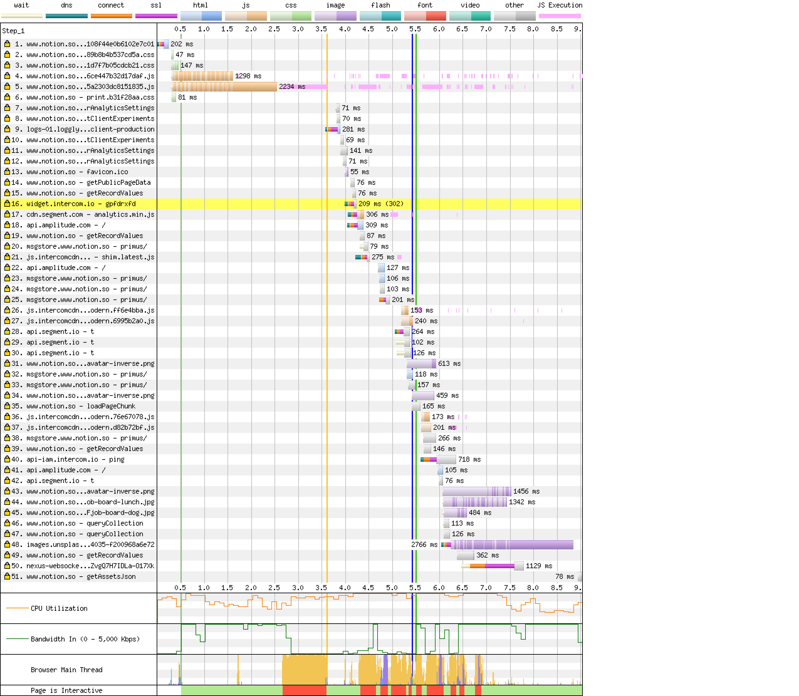

Woah, that’s a lot of info. What’s going on there?

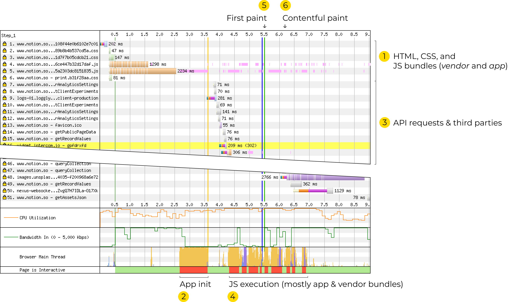

Here’s what’s going on:

1. You open the page. The page loads a few stylesheets – and two JavaScript bundles, `vendor` and `app`.

2. Once both bundles are loaded, they start to execute – and spend a whole second doing so.

3. Once the app has been initialized, it starts sending API requests for page data, loading analytics...

4. and executing more code...

5. until, at 5.6 seconds, the first paint happens:

   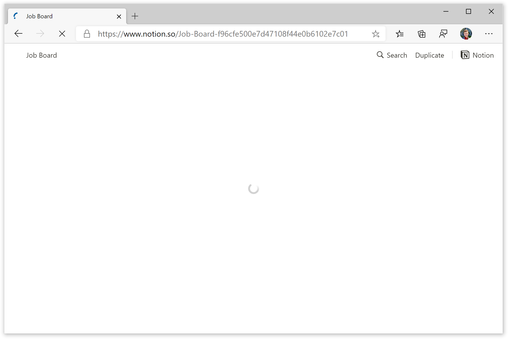

   ...but it’s just a spinner.

6. At 6.2 seconds, [the page content gets actually rendered](https://webpagetest.org/video/compare.php?tests=200418_KE_d8c556d0fa8e60a79cd2370f224b3ad7-r%3A1-c%3A0&thumbSize=200&ival=100&end=visual).

   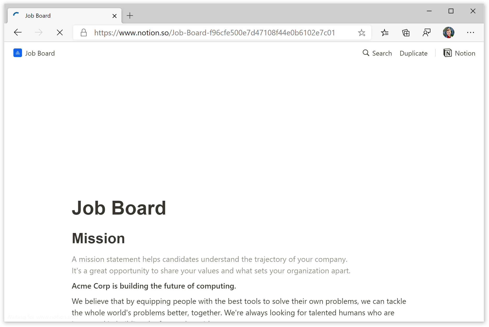

   It takes a couple more seconds to finish loading all the hero image.

6.2 seconds for a desktop computer is quite a lot. However, with a medium-tier phone like Nexus 5, this time [increases to 12.6 seconds](https://webpagetest.org/video/compare.php?tests=200420_7E_24739856690fea9cbdadeea3e0b934a2-r%3A1-c%3A0&thumbSize=200&ival=100&end=visual). Here’s how that feels:

![{sources:[{src:"./notion-video.webm", type:"video/webm"}]}](./notion-video.mp4)

Let’s see how we can improve it.

# Cost of JavaScript

When one talks about “loading speed”, one typically means _networking performance_. From the networking standpoint, Notion is doing well: they’re using HTTP/2, they’re gzipping files, and they’re using Cloudflare as a proxying CDN.

However, another part of “loading speed” that people talk less about is _processing performance_. All downloaded resources have a processing cost: gzip archives need to be decompressed; images need to be decoded; JS needs to be executed.

Unlike networking performance, processing performance doesn’t improve with better networks – it’s only as fast as the user’s CPU is. And user’s CPUs in phones – especially Android phones – [are _bad_](https://medium.com/@addyosmani/the-cost-of-javascript-in-2018-7d8950fbb5d4):

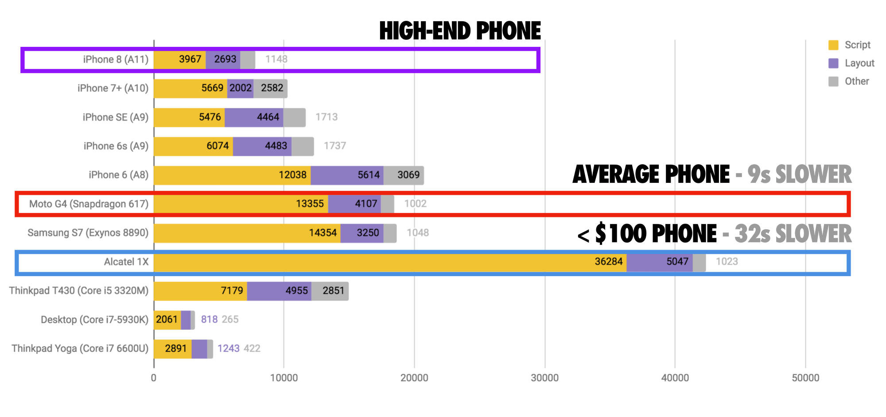

For Notion, processing performance is even more significant. It’s easy to avoid networking costs by caching network resources in the app. But processing costs are paid _every single time_ the app starts – which means a phone user may see a 10-second splash screen multiple times a day.

On our test Nexus 5, executing `vendor` and `app` bundles takes 4.9 seconds. This whole time, the page – and the app – stay non-interactive and empty:

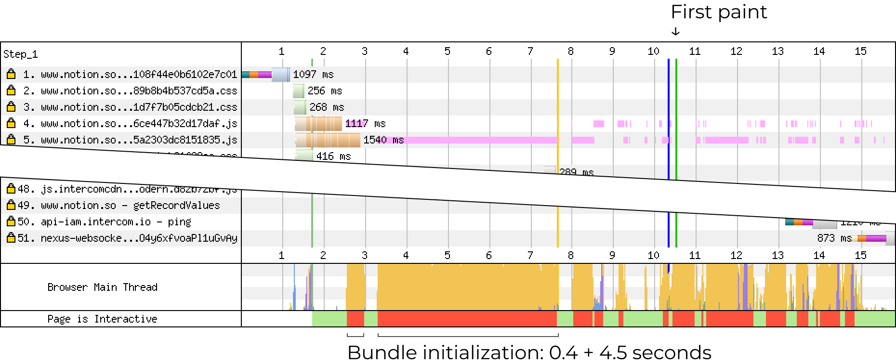

What’s happening there? WebPageTest doesn’t record JS traces, but if we go to DevTools and run a local audit, we’ll see this:

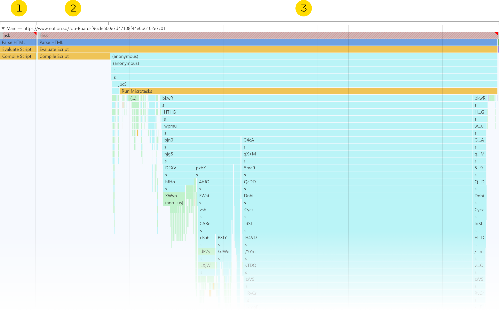

First, the `vendor` bundle is being compiled (for 0.4s). Second, the `app` bundle is being compiled (for 1.2s). Third, both bundles start executing – and spend 3.3s doing so.

So how can we reduce that time?

# Defer JS execution

Let’s take a look at the bundle execution phase. What are all these functions?

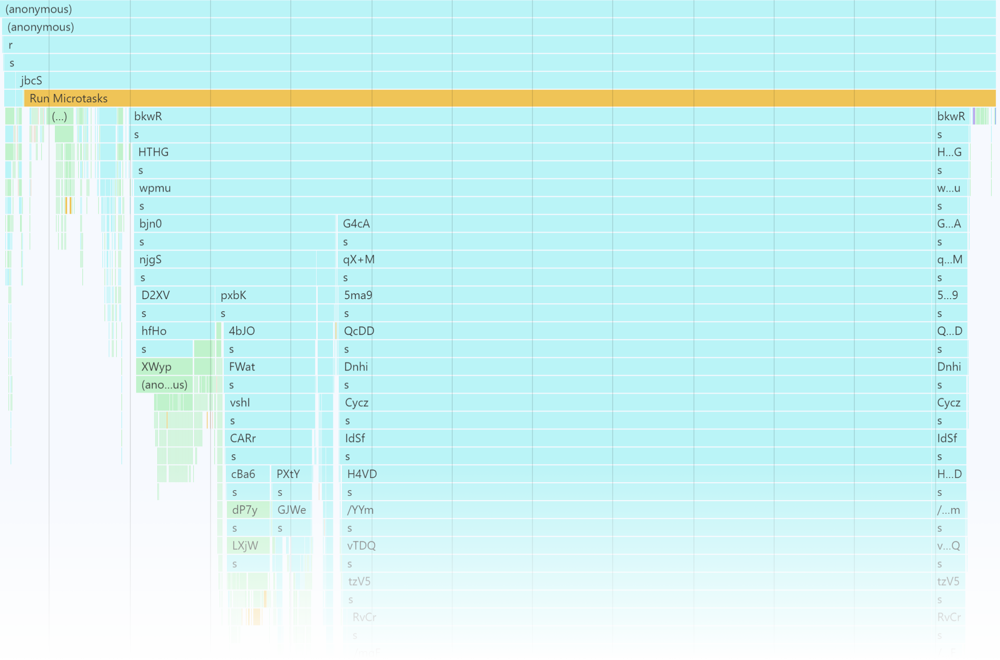

Turns out that’s bundle initialization:

- _Functions with four-character names_, like `bkwR` or `Cycz`, are application modules.

  <!-- prettier-ignore -->
  [[sidenote | Four-character IDs (like `bkwR` or `Cycz`) are used when [`optimization.moduleIds: 'hashed'`](https://v4.webpack.js.org/configuration/optimization/#optimizationmoduleids) or [`HashedModuleIdsPlugin`](https://webpack.js.org/plugins/hashed-module-ids-plugin/) is enabled.]]
    |
    | When webpack builds a bundle, it wraps each module with a function – and assigns it an ID. That ID becomes the function name. In the bundle, this looks as follows:
    |
    | _Before:_
    |
    | ```js
    | import formatDate from './formatDate.js';
    |
    | // ...
    | ```
    |
    | _After:_
    |
    | ```js
    | fOpr: function(module, __webpack_exports__, __webpack_require__) {
    |   "use strict";
    |
    |   __webpack_require__.r(__webpack_exports__);
    |
    |   var _formatDate__WEBPACK_IMPORTED_MODULE_0__ =
    |     __webpack_require__("xN6P");
    |
    |   // ...
    | },
    | ```

- _And the `s` function_ is actually `__webpack_require__`.

  `__webpack_require__` is the webpack’s internal function that it uses for requiring modules. Whenever you write an `import`, webpack transforms it to `__webpack_require__()`.

Bundle initialization takes so much time because it executes all the modules. Each module may take just a few milliseconds to execute, but with Notion’s 1100+ modules, this adds up.

The only way to fix it is to execute fewer modules upfront.

## Use code splitting

The best way to improve the startup time is to code-split away some features that’re not needed immediately. In webpack, this is done [using `import()`](https://webpack.js.org/guides/code-splitting/):

```jsx
// Before
<Button onClick={openModal} />

// After
<Button
  onClick={() => import('./Modal').then(m => m.openModal())}
/>
```

<mark>Code splitting is the best first optimization you can do.</mark> It brings huge performance benefits: after doing code splitting, Tinder reported [a 60% decrease in the complete load time](https://medium.com/@addyosmani/a-tinder-progressive-web-app-performance-case-study-78919d98ece0); and our client, Framer, managed to [cut 40-45% off the CPU Idle time](https://3perf.com/#clients).

There are [several common approaches to code splitting](https://medium.com/js-dojo/3-code-splitting-patterns-for-vuejs-and-webpack-b8fff1ea0ba4):

- splitting the bundle by pages,

- splitting away below-the-fold code,

- and splitting away conditional content (any dynamic UIs that are not visible immediately)

The Notion app doesn’t have pages, and code-splitting below-the-fold content is hard because pages are very dynamic. This means the only useful approach is code-splitting conditional content. The following parts may be good candidates for that:

- _Settings_, _Import_, _Trash_ – all UIs that are rarely used

- _Sidebar_, _Share_, _Page options_ – all UIs that are frequently used but are not needed immediately when the app starts. Those could be preloaded and initialized right after the app starts

- _Heavy page blocks._ Some page blocks are quite heavy – e.g. the _Code_ block supports highlighting 68 languages, which bundles 120+ minified KBs of language definitions from Prism.js. Notion seems to be code-splitting some blocks already (e.g., _Math equation_), but it might make sense to extend it to others as well.

## Check that module concatenation is working

In webpack, the [module concatenation](https://webpack.js.org/plugins/module-concatenation-plugin/) feature is responsible for merging multiple small ES modules into one large. This reduces the module processing overhead and makes removing unused code more effective.

To confirm that module concatenation is working:

- check that you’re not transpiling ES modules to CommonJS with Babel. [`@babel/preset-env`](https://babeljs.io/docs/en/babel-preset-env) doesn’t transpile ES modules into CommonJS

- check that [`optimization.concatenateModules`](https://webpack.js.org/configuration/optimization/#optimizationconcatenatemodules) is not disabled explicitly

- run the production webpack build with [`--display-optimization-bailout`](https://webpack.js.org/plugins/module-concatenation-plugin/#debugging-optimization-bailouts) to see if there are any cases where module concatenation bails out

[[note]]
| **Fun fact.** Remember that all imports are transformed into the `__webpack_require__` function?
|
| Well, what happens when the same function is called 1100 times throughout initialization? Right, it becomes a hot path taking 26.8% of the total time:
|
| 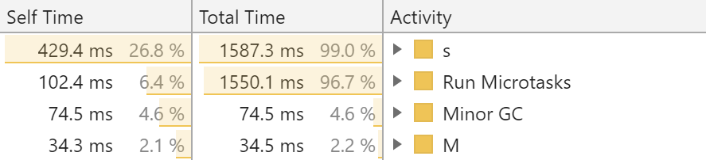
|
| (`s` is the minified name of `__webpack_require__`.)
|
| Unfortunately, apart from concatenating more modules, [there’s not much to optimize there](https://github.com/webpack/webpack/issues/2219).

## Try the `lazy` option of Babel’s `plugin-transform-modules-commonjs`

[[note]]
| **Note:** this suggestion relies on disabling module concatenation. Because of that, it’s incompatible with the previous one.

[`@babel/plugin-transform-modules-commonjs`](https://babeljs.io/docs/en/babel-plugin-transform-modules-commonjs#lazy) is an official Babel plugin that transforms ES imports into CommonJS `require()`s:

```js
// Before
import formatDate from './formatDate.js';
export function getToday() {
  return formatDate(new Date());
}

// After
const formatDate = require('./formatDate.js');
exports.getToday = function getToday() {
  return formatDate(new Date());
};
```

And with its `lazy` option enabled, it also inlines all `require`s right into where they’re used:

```js
// After, with `lazy: (path) => true`, simplified
exports.getToday = function getToday() {
  return require('./formatDate.js')(new Date());
};
```

Thanks to this transformation, if the `getToday()` function is never called, `./formatDate.js` is never imported! And we don’t pay the import cost.

There are a few drawbacks, however:

- Switching the existing codebase to `lazy` might be tricky. Some modules may rely on side effects from other modules, which we’re delaying here. Also, [the plugin docs](https://babeljs.io/docs/en/babel-plugin-transform-modules-commonjs#lazy) warn that the `lazy` option breaks cyclic dependencies

- [[sidenote | This doesn’t affect webpack 5, as it [will add support for CommonJS tree shaking](https://github.com/webpack/changelog-v5/blob/df28f37494ee62967623af75d8f3fe45bd70fe5b/README.md#commonjs-tree-shaking).]]
  | Switching to CommonJS modules disables [tree shaking in webpack](https://webpack.js.org/guides/tree-shaking/). This means some unused code may be kept in the bundle

- Switching to CommonJS modules disables [module concatenation](https://webpack.js.org/plugins/module-concatenation-plugin/). This means the module processing overhead will be higher

These drawbacks make this option riskier compared to others – but if it plays right, its benefits might far outweigh its costs.

[[note]]
| <strong id="note-coverage">How many modules could be deferred like this?</strong> Chrome DevTools let us find an easy answer. Open any JS-heavy page (e.g. [the Notion one](https://www.notion.so/iamakulov/Job-Board-f96cfe500e7d47108f44e0b6102e7c01)), go to DevTools, press <kbd>Ctrl+Shift+P</kbd> (Windows) or <kbd>⌘⇧P</kbd> (macOS), type in “start coverage”, and press Enter. The page will reload, and you’ll see how much code was executed in the initial render.
|
| In Notion, 39% of the vendor bundle and 61% of the app bundle are unused after the page renders:
|
| 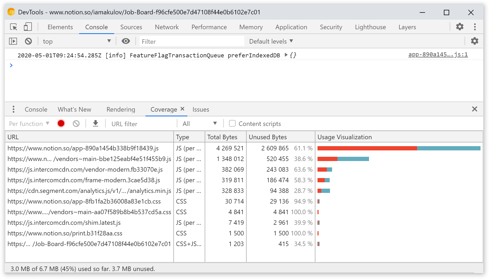

# Remove unused JS code

Let’s take a look at the bundle initialization trace again:


A significant part here is “Compile Script” (parts 1 and 2), which takes 1.6s in total. What is that?

V8 (Chrome’s JS engine), just like other JS engines, [uses just-in-time compilation](https://blog.sessionstack.com/how-javascript-works-inside-the-v8-engine-5-tips-on-how-to-write-optimized-code-ac089e62b12e) to run JavaScript. This means all code it executes has to be compiled into machine code first.

And the more code there is, the more time it takes to compile it. In 2018, on average, V8 was spending [10-30% of total execution time](https://medium.com/@addyosmani/the-cost-of-javascript-in-2018-7d8950fbb5d4) in parsing and compiling JavaScript. In our case, the compilation step takes 1.6s out of a total of 4.9s – a whopping 32%.

[[sidenote | Another great approach would be to precompile JavaScript into machine code – and avoid parsing costs altogether by running compiled JavaScript. However, [this is not currently possible.](https://gist.github.com/addyosmani/4009ee1238c4b1ff6f2a2d8a5057c181)]]
| The only way to reduce the compilation time is to serve less JavaScript.

## Use code splitting

Yes, this again. By code-splitting unused functionality, you not only [reduce bundle init time](#defer-js-execution), but also decrease the compilation time. The less JS code there is, the faster it compiles.

Check out [the previous section on code splitting](#use-code-splitting) where we’ve talked about common code-splitting approaches & how Notion could benefit from it.

## Remove unused vendor code

[As we saw](#note-coverage), when a page loads, almost 40% of the Notion’s `vendor` bundle stay unused:


Some of that code will be needed later when the user does something in the app. But how much?

Notion doesn’t publish source maps, which means we can’t use [`source-map-explorer`](https://www.npmjs.com/package/source-map-explorer) to explore the bundle and see the largest modules. However, we could still guess libraries from their minified source – by looking at non-minified strings & searching for them in GitHub.

Based on my analysis, here’re the 10 largest modules in the `vendor` bundle:

[[sidenote | This list does not include libraries that are composed of multiple small files.<br />For example, the bundle also includes [`core-js`](https://github.com/zloirock/core-js), which [occupies 154 KB](https://bundlephobia.com/result?p=core-js@3.6.5) but consists of 300+ small files.]]
| <ol class="list list_compact" reversed>
| <li><code>fingerprintjs2</code> → 29 KB</li>
| <li><code>moment-timezone</code> → 32 KB</li>
| <li><code>chroma-js</code> → 35 KB</li>
| <li><code>tinymce</code> → 48 KB</li>
| <li><code>diff-match-patch</code> → 54 KB</li>
| <li><code>amplitude-js</code> → 55 KB</li>
| <li><code>lodash</code> → 71 KB</li>
| <li><code>libphonenumber-js/metadata.min.json</code> → 81 KB</li>
| <li><code>react-dom</code> → 111 KB</li>
| <li><code>moment</code> with all locales → 227 KB</li>
| </ol>

Out of all these modules, the most significant _and_ easy to optimize ones are <code>moment</code>, <code>lodash</code> and <code>libphonenumber-js</code>.

**[`moment`](https://github.com/moment/moment)**, a JS library for manipulating dates, is bundling 160+ minified KBs of localization files. Given than Notion is only available in English, this is hardly needed.

What can one do here?

- First, drop unused `moment` locales using [`moment-locales-webpack-plugin`](https://www.npmjs.com/package/moment-locales-webpack-plugin).

- [[sidenote|[You-Dont-Meed-Momentjs](https://github.com/you-dont-need/You-Dont-Need-Momentjs): List of functions which you can use to replace moment.js]]
  | Second, consider switching from `moment` to [`date-fns`](https://date-fns.org/). Unlike with `moment`, when you’re using `date-fns`, you’re importing only specific date manipulation methods you need. So if you only use `addDays(date, 5)`, you won’t end up bundling the date parser.

**[`lodash`](https://github.com/lodash/lodash)**, a set of data manipulation utilities, bundles 300+ functions for working with data. That’s too much – from what I’ve seen, apps typically use 5-30 of those methods at most.

The easiest way to drop unused methods is to use [`babel-plugin-lodash`](https://github.com/lodash/babel-plugin-lodash). Apart from that, [`lodash-webpack-plugin`](https://www.npmjs.com/package/lodash-webpack-plugin) supports removing some lodash features (like caching or Unicode support) _from inside_ these methods.

**[`libphonenumber-js`](https://github.com/catamphetamine/libphonenumber-js)**, a library for parsing and formatting phone numbers, bundles [an 81 KB JSON file](https://unpkg.com/libphonenumber-js@1.0.1/metadata.min.json) with phone number metadata.

I can’t see any places where phone numbers are used, so it’s likely this library supports a single use case somewhere deep in the Notion UI. It’d be great to replace it with another library or custom code – and drop the whole dependency.

## Remove polyfills

Another major dependency present in the `vendor` bundle is polyfills from [the `core-js` library](https://github.com/zloirock/core-js):

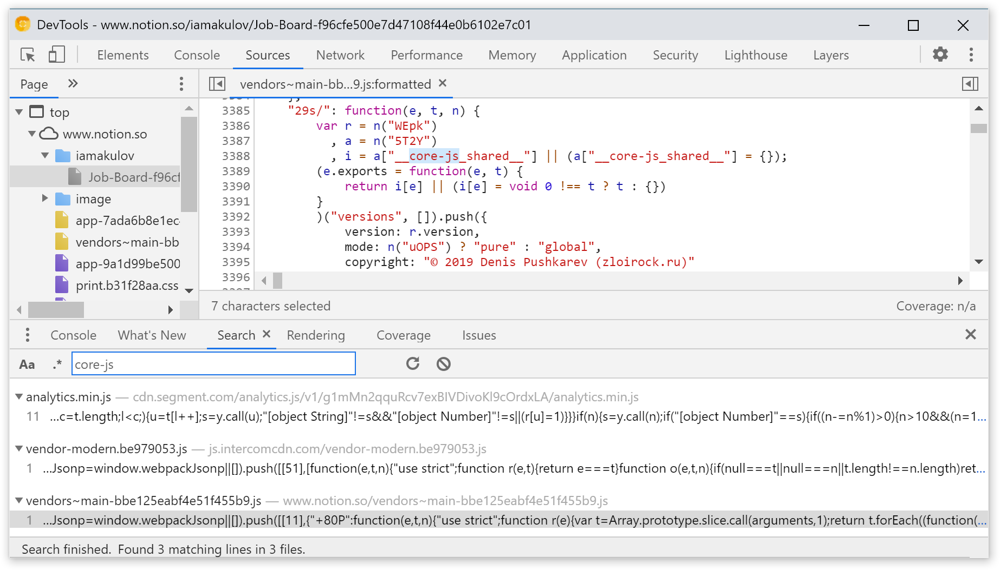

There are two problems with it.

**It’s unnecessary.** We’re testing Notion in Chrome 81, which supports all the modern JS features. However, the bundle still includes polyfills for `Symbol`, `Object.assign`, and many other methods. These polyfills have to be downloaded, parsed, and compiled – all for nothing.

This also affects Notion apps. In the desktop app (and probably in the mobile one as well), the JS engine version is modern, fixed, and well-known. There’s zero chance `Symbol` or `Object.assign` would be absent there – however, the app still downloads the same polyfills.

What should we do instead? Ship polyfills for older browsers, but skip them for modern ones. See [“How to load polyfills only when needed”](/blog/polyfills/) for a few ways to do this.

**It’s bundled multiple times.** The `vendor` bundle includes the `core-js` copyright 3 times. Each time, the copyright is identical, but is shipped in a different module and with different dependencies:

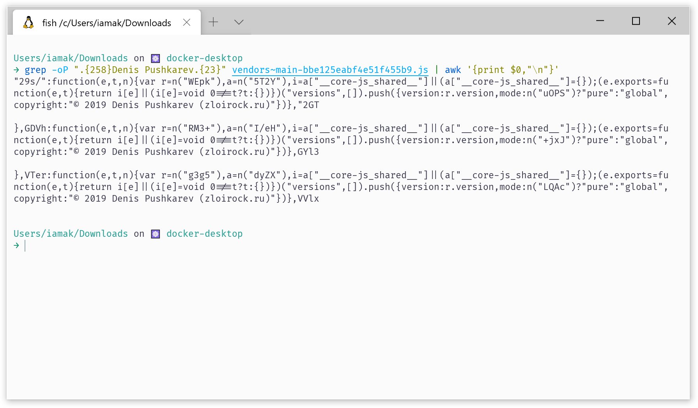

This means `core-js` itself is bundled 3 times. But why? Let’s dig deeper.

In a non-minified form, the module with the copyright [looks like this](https://github.com/zloirock/core-js/blob/v2/modules/_shared.js):

```js
var core = require('./_core');
var global = require('./_global');
var SHARED = '__core-js_shared__';
var store = global[SHARED] || (global[SHARED] = {});

(module.exports = function (key, value) {
  return store[key] || (store[key] = value !== undefined ? value : {});
})('versions', []).push({
  version: core.version,
  mode: require('./_library') ? 'pure' : 'global',
  copyright: '© 2019 Denis Pushkarev (zloirock.ru)',
});
```

Here, we have two bits that describe the library:

- `var core = require('./_core'); core.version` for the library version, and
- `require('./_library') ? 'pure' : 'global'` for [the library mode](https://github.com/zloirock/core-js/tree/v2#basic)

In the minified code, that corresponds to:

- `var r=n(<MODULE_ID>);r.version` for the library version, and
- `n(<MODULE_ID>)?"pure":"global"` for the mode

If we follow these module IDs in the bundle, we’ll see this:

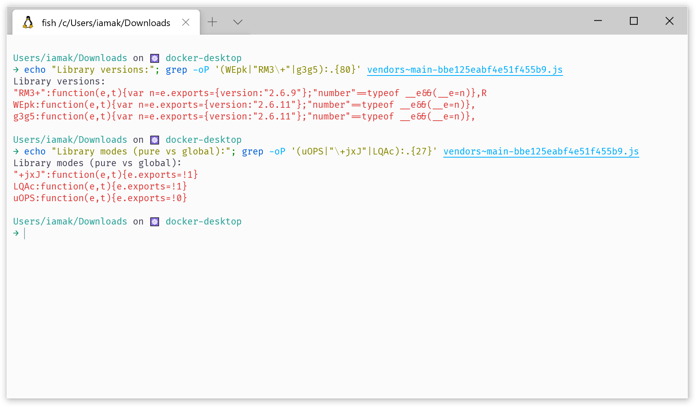

Woah. This means these three versions of `core-js` are:

- `2.6.9` in the `global` mode,
- `2.6.11` in the `global` mode, and
- `2.6.11` in the `pure` mode

Turns out, [this is a common issue](https://twitter.com/iamakulov/status/1225069880988270592). This happens when your app depends on one version of `core-js`, but some of your dependencies depend on another.

How to solve it? Run `yarn why core-js` to figure out what depends on the remaining two versions. And either remove/reconfigure dependencies that bundle extra `core-js` versions; or deduplicate all three versions into one using webpack’s [`resolve.alias`](https://webpack.js.org/configuration/resolve/#resolvealias):

https://twitter.com/iamakulov/status/1262391881364897796

# Optimize the loading waterfall

Let’s take another look at [how Notion is loading](https://webpagetest.org/result/200418_KE_d8c556d0fa8e60a79cd2370f224b3ad7/1/details/#waterfall_view_step1):

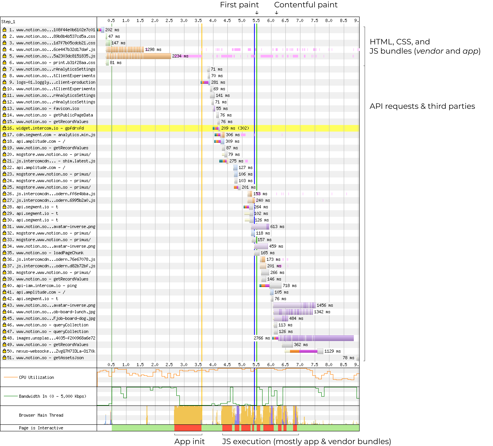

A few things are striking the attention here:

- API requests don’t start happening until the bundle is fully downloaded

- Contentful paint (which is when the actual content becomes visible) doesn’t happen until most of the API requests are done. (Specifically, it waits for request 35, `loadPageChunk`)

- API requests are mixed with third parties: Intercom, Segment, and Amplitude

Here’s how to optimize that.

## Defer third parties

[[sidenote|Harry Roberts has a great talk about third parties: [It’s my (third) party, and I’ll cry if I want to](https://vimeo.com/302785171)]]
| Third parties are scripts from other domains we add for ads, analytics, or similar functionality. Business-wise, they’re both useful _and_ problematic:
|
| - _Useful:_ we add third parties for a concrete business value (e.g., analyzing how users use the app) that we won’t get otherwise
|
| - _Problematic:_ third parties typically hurt loading performance [which negatively affects conversion and user satisfaction](https://wpostats.com)

[[sidenote|[How to block third party requests in WebPageTest](https://andydavies.me/blog/2018/02/19/using-webpagetest-to-measure-the-impact-of-3rd-party-tags/)]]
| In Notion, third parties (Intercom, Segment, and Amplitude) hurt performance by executing JavaScript and blocking the main thread when it’s most needed – when the app is still initializing. If we block them in WebPageTest, our Nexus 5 [will render the content a whole second earlier](https://webpagetest.org/video/compare.php?tests=200509_WD_694540be3e401cb9c7ee047049645625-l%3AWith+third+parties%2C200509_CQ_e1f940ff9233f0936af303918df8e298-l%3AWithout+third+parties&thumbSize=200&ival=100&end=visual):

![{sources:[{src:"./third-parties.webm", type:"video/webm"}]}](./third-parties.mp4)

In the real life, we can’t simply remove all the Notion third parties. But we can defer them – like this:

```js
// Before
async function installThirdParties() {
  if (state.isIntercomEnabled) intercom.installIntercom();

  if (state.isSegmentEnabled) segment.installSegment();

  if (state.isAmplitudeEnabled) amplitude.installAmplitude();
}

// After
async function installThirdParties() {
  setTimeout(() => {
    if (state.isIntercomEnabled) intercom.installIntercom();

    if (state.isSegmentEnabled) segment.installSegment();

    if (state.isAmplitudeEnabled) amplitude.installAmplitude();
  }, 15 * 1000);
}
```

This would make sure they are not loaded until the app has fully initialized.

[[note]]
| **`setTimeout` vs `requestIdleCallback` vs events.** `setTimeout` is not the best approach (hard-coding the timeout is hacky), but it’s good enough.
|
| The best approach would be to listen for some kind of a “page fully rendered” in-app event, but I’m not sure whether Notion has one.
|
| [`requestIdleCallback`](https://developer.mozilla.org/en-US/docs/Web/API/Window/requestIdleCallback) might sound like the perfect tool for the job, but it’s not. In my tests in Chromium, it triggers too early – merely 60 ms after the main thread becomes idle.

[[note]]
| **Loading analytics on interaction.** Another great approach to defer analytics is to avoid loading it until the first user’s interaction – the first click or tap.
|
| However, note that this makes analytics invisible for synthetic tests (like Lighthouse or PageSpeed Insights). To measure the real JavaScript cost for users, you should install a Real User Monitoring library – e.g. [LUX from SpeedCurve](https://speedcurve.com/features/lux/) or [Browser Insights from Cloudflare](https://blog.cloudflare.com/introducing-browser-insights/).

## Preload API data

In Notion, before the page is rendered, the browser has to send 9 requests to the API:


Each request may take from 70 ms (in case of [a cable connection](https://webpagetest.org/result/200418_KE_d8c556d0fa8e60a79cd2370f224b3ad7/1/details/#waterfall_view_step1)) to 300-500 ms (in case of [a 4G connection and a medium-tier phone](https://webpagetest.org/result/200420_7E_24739856690fea9cbdadeea3e0b934a2/1/details/#waterfall_view_step1)). And some of these requests seem sequential – they aren’t sent before previous requests complete.

This means slow API requests can easily result in significant latency. In my tests, removing this latency [makes the page render 10% faster](https://gist.github.com/iamakulov/7fb2e981748087712b6b5a26a06f67a8).

But how can we remove the latency in the real app?

**Inline page data into the HTML.** The best approach would be to calculate the API data on the server side – and include it directly into the HTML response. E.g., like this:

<!-- prettier-ignore -->
[[sidenote|Make sure to: <br />a) encode data as JSON [for best performance](https://joreteg.com/blog/improving-redux-state-transfer-performance); <br />b) escape data with [`jsesc`](https://github.com/mathiasbynens/jsesc) (`json: true, isScriptContext: true`) to avoid XSS attacks.<br><br>Also, note that bundles have the `defer` attribute. We need it to execute bundles _after_ the `__INITIAL_STATE__` script.]]
| ```js
| app.get('*', (req, res) => {
|   /* ... */
|
|   // Send the bundles so the browser can start loading them
|   res.write(`
|     <div id="notion-app"></div>
|     <script src="/vendors-2b1c131a5683b1af62d9.js" defer></script>
|     <script src="/app-c87b8b1572429828e701.js" defer></script>
|   `);
|
|   // Send the initial state when it’s ready
|   const stateJson = await getStateAsJsonObject();
|   res.write(`
|     <script>
|       window.__INITIAL_STATE__ = JSON.parse(${stateString})
|     </script>
|   `);
| })
| ```

With this approach, the app won’t need to wait for API responses. It will retrieve the initial state from the `window` and start rendering immediately.

[[note]]
| **Cloudflare workers.** Notion uses Cloudflare as a CDN provider. If Notion’s HTML pages are static (e.g., they’re served by AWS S3), [Cloudflare workers](https://workers.cloudflare.com/) might be useful instead.
|
| With Cloudflare workers, you can intercept the page, fetch dynamic data straight from the CDN worker, and append the data into the end of the page. See:
|
| - [Streams documentation](https://developers.cloudflare.com/workers/reference/apis/streams/) for details on how to transform the response on the go
|
| - [Streaming recipes](https://developers.cloudflare.com/workers/archive/recipes/streaming-responses/) and [Fast Google Fonts](https://github.com/cloudflare/worker-examples/tree/master/examples/fast-google-fonts) for some examples of how this can be done

**Inline a script to prefetch page data.** Another approach is to write an inline script that will request the data ahead of time:

<!-- prettier-ignore -->
```html
<div id="notion-app"></div>
<script>
  fetchAnalytics();
  fetchExperiments();
  fetchPageChunk();

  function fetchAnalytics() {
    window._analyticsSettings = fetch(
      '/api/v3/getUserAnalyticsSettings',
      {
        method: 'POST',
        body: '{"platform": "web"}',
      }
    ).then((response) => response.json());
  }

  async function fetchExperiments() { /* ... */ }

  async function fetchPageChunk() { /* ... */ }
</script>
<script src="/vendors-2b1c131a5683b1af62d9.js"></script>
<script src="/app-c87b8b1572429828e701.js"></script>
```

The app can then simply `await` on `window._analyticsSettings` (and similar promises). If the data is loaded by that time, the app will get it near-immediately.

The important bit: the script should start sending requests as soon as possible. This will increase the chance that responses will arrive – and be handled – while the bundles are still loading and the main thread is idle.

# Other stuff

Optimizations above should bring the most benefits. But there are a few other things that are worth paying attention to.

## `Cache-Control` on responses

Notion doesn’t set the `Cache-Control` header on its responses. This doesn’t disable caching – but means [each browser would cache the response differently](https://paulcalvano.com/index.php/2018/03/14/http-heuristic-caching-missing-cache-control-and-expires-headers-explained/). This could lead to some unexpected client-side bugs.

To avoid this, set the proper `Cache-Control` header on bundle assets and API responses:

https://twitter.com/iamakulov/status/1259763674409033735

## Loading skeleton

The Notion app has a spinner that’s shown while the page is loading:


The spinner helps to signify that “something is loading”. However, sometimes, the spinner actually [worsens the perceived performance](https://www.lukew.com/ff/entry.asp?1797). Users see the spinner and _pay attention_ to the fact that something is loading – which makes the app feel slower.

What could be done instead is [showing a skeleton of the UI](https://uxdesign.cc/what-you-should-know-about-skeleton-screens-a820c45a571a):

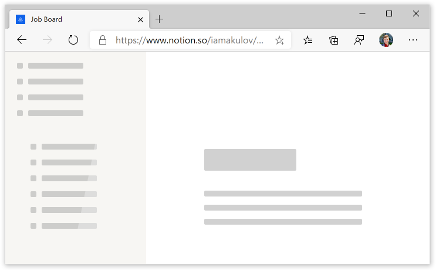

It’s small enough to be inlineable, and it prepares the user for the actual UI.

# Summing up

So, how much time can all these optimizations save us?

- Let’s assume that we manage to shave 30% off the vendor bundle by [removing unused dependencies](#remove-unused-vendor-code) and [not shipping polyfills](#remove-polyfills). Additionally, let’s assume we manage to [code-split away](#use-code-splitting) 20% of the main bundle.

  It’s hard to say how much that will reduce the compilation and execution time – the effect can be from 10% to 50% – but let’s stick with 25%. On our Nexus 5, total JS time [without third parties](#defer-third-parties) was 6.4s – so 25% of it would be 1.6s.

- [Preloading the API data](#preload-api-data) can reduce time to contentful paint by 10%. With Nexus 5, that’ll be 10% of 12.6s = 1.3s.

- And [deferring third parties](#defer-third-parties) can save us another second.

In total, based on this (very rough) calculation, <mark>we save 3.9 out of 12.6 seconds – a 30% improvement</mark> just by tuning some configs and deferring some loading. And this is after great speed improvements the Notion team has already done.

It turns out, almost every app has low-hanging fruits that could be implemented just by tuning the bundler configuration and doing a few precise code changes. So here’s [the easiest way to find and pick them](/#services). And if you read this far and liked this case study, consider spreading the word about it:

https://twitter.com/iamakulov/status/1262729442159443973

<br>

_Thanks to Radion Chernyakov, Semyon Muravyov, Victor Kolb, Nikolay Kost for their draft reviews and helpful suggestions._
