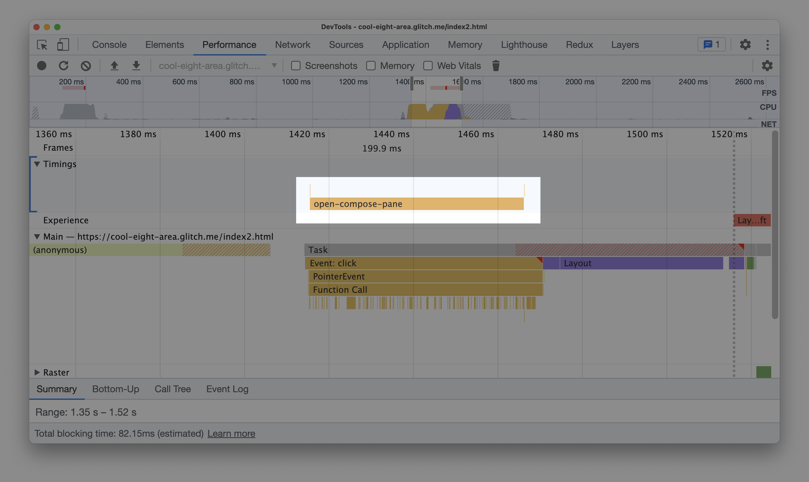
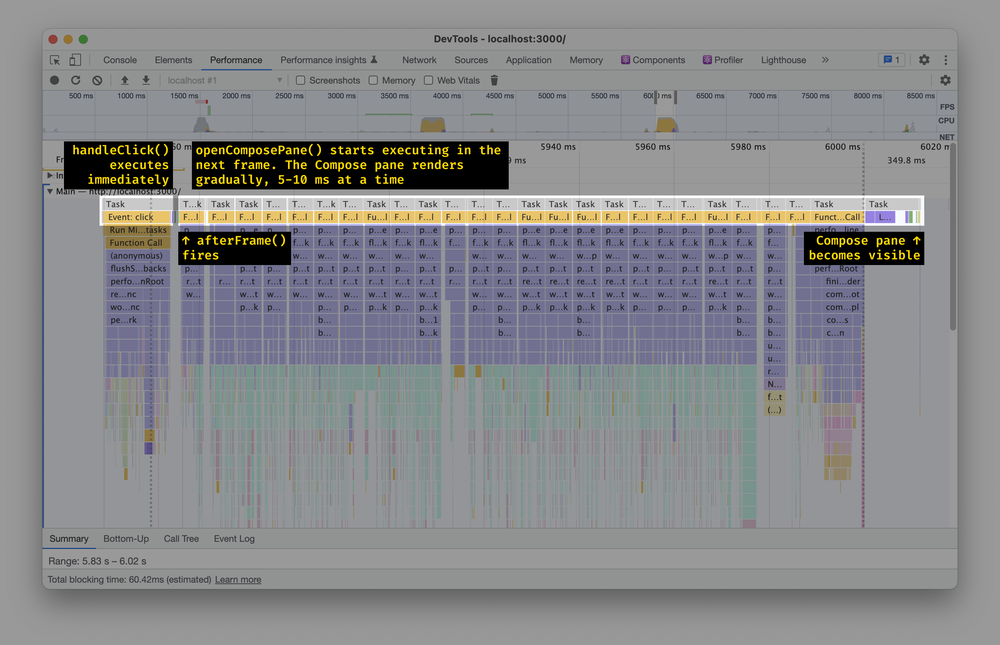

Say you just finished optimizing your React app and made every button click as fast as possible. Now, you want to keep an eye on the app’s performance – and learn if it gets slower again so you can fix it.

Here’s how to do that.

[[note]]
| **Disclaimer: not battle-tested.** This guide is based on the experiences of clients I worked with, plus my experiments in the field. It’s how I would approach setting up performance tests today. However, I haven’t had a chance to implement this in a real-world app myself yet.
|
| This means I might not be aware of some edge cases or pitfalls. This guide should be a good starting point for setting up your monitoring system, but it might (or might not!) need fine-tuning to be useful.
|
| (Have your experience to add? Please [share it](https://twitter.com/iamakulov/status/1533885339168714752).)

```toc
# This code block gets replaced with the TOC
header: Contents
```

# No Ready-To-Go Solutions

Tracking runtime performance is challenging. With loading performance, there’s a [whole lot](https://treo.sh) of [tools](https://github.com/GoogleChrome/lighthouse-ci) you [could](https://github.com/GoogleChrome/web-vitals#send-the-results-to-google-analytics) just [plug in](https://www.speedcurve.com) and [start](https://sentry.io/for/web-vitals/) collecting [data](https://www.webpagetest.org). There’s nothing like that for runtime performance.

To monitor your app responsiveness, you’d need to do some work.

# Step 1: Pick the Most Important Interactions

Pick the interactions you care about the most. For example, for an app like Gmail, that could be:

- Clicking the “Compose” button
- Opening an email thread
- Typing in the search field


# Step 2: Instrument Every Interaction

For every interaction, find the moment when it starts – and wrap it with code that would measure its duration.

Here’s how this might look with Gmail’s Compose button:

<!-- prettier-ignore -->
[[sidenote|[afterFrame docs](https://github.com/andrewiggins/afterframe)]]
| ```js
| import afterFrame from 'afterframe';
|
| function measureInteraction() {
|   // performance.now() returns the number of ms
|   // elapsed since the page was opened
|   const startTimestamp = performance.now();
|
|   return {
|     end() {
|       const endTimestamp = performance.now();
|       console.log('The interaction took', endTimestamp - startTimestamp, 'ms');
|     },
|   };
| }
|
| const ComposeButton = () => {
|   const handleClick = () => {
|     const interaction = measureInteraction();
|
|     // The afterFrame library calls the function
|     // when the next frame starts
|     afterFrame(() => {
|       interaction.end();
|     });
|
|     openComposePane();
|   };
|
|   return <Button onClick={handleClick}>Compose</Button>;
| };
| ```

This code will execute `measureInteraction()`, then open the compose pane, then paint the update on the screen, and _then_ call `interaction.end()`:


### Why use `afterFrame`?

[`afterFrame`](https://github.com/andrewiggins/afterframe) was specifically designed to take a function and run it right after the current frame ends. With `afterFrame`, we end up measuring the whole duration of the interaction – including the time it takes for the browser to prepare and apply updates on the screen.

Compare this with e.g. `requestAnimationFrame`. A callback you pass into `requestAnimationFrame` executes either before “Recalculate styles & layout” or before “Paint”, depending on the browser. As a result, the measurement omits one or several parts of the browser’s processing:


`setTimeout(..., 0)`, `Promise.resolve().then()` and other straightforward solutions also struggle from similar issues. See [“Accurately measuring layout on the web”](https://nolanlawson.com/2018/09/25/accurately-measuring-layout-on-the-web/) by Nolan Lawson for more.

### Why not `useEffect`?

Most of the time, a function you’d pass into `useEffect` would be called at the beginning of the next frame – just like `afterFrame`.

However, with React 18, if the app updates in response to user input, [`useEffect` fires synchronously](https://github.com/reactwg/react-18/discussions/128). And even with React 17 and below, a `useEffect` will also run early if [you have scheduled several renders in a row](https://stackoverflow.com/a/53048903/1192426).

### Why not `performance.mark()`/`performance.measure()`?

Instead of using `performance.now()` to measure how long an interaction took, you could also use [`performance.mark()`](http://developer.mozilla.org/en-US/docs/Web/API/Performance/mark) and [`performance.measure()`](http://developer.mozilla.org/en-US/docs/Web/API/Performance/measure) APIs:

```js
function measureInteraction(interactionName) {
  // Don’t do this
  performance.mark(interactionName + ' start');

  return {
    end() {
      performance.mark(interactionName + ' end');
      const measure = performance.measure(
        interactionName + ' duration',
        interactionName + ' start',
        interactionName + ' end',
      );
      console.log('The interaction took', measure.duration, 'ms');
    },
  };
}
```

This has a useful side effect. `performance.measure()` entries are visible in Chrome DevTools, which makes debugging performance issues easier:



However, in Chrome, `performance.measure()` calls consume _a lot_ of memory. In my tests, creating 5000 `performance.measure()` entries causes the browser’s tab to increase its memory usage by ~100 MB. And if your app stays open for a while – like Gmail or Figma – 5000 entries is not that much!

### How does this work with React 18’s concurrent rendering?

This, unfortunately, doesn’t. If the interaction you’re trying to measure uses `useTransition` or `useDeferredValue`:

```js
const ComposeButton = () => {
  const [isTransitioning, startTransition] = useTransition();

  const handleClick = () => {
    const interaction = measureInteraction();

    afterFrame(() => {
      interaction.end();
    });

    startTransition(() => {
      openComposePane();
    });
  };

  return <Button onClick={handleClick}>Compose</Button>;
};
```

`afterFrame` will fire too early:



With concurrent rendering, you’d probably need to use `useEffect` instead, even though [it’s imprecise](#why-not-useeffect).

# Step 3: Collect Measured Durations

[[sidenote|Other teams I’ve worked with also used [DataDog](https://www.datadoghq.com), [New Relic](https://newrelic.com), and custom solutions built upon [Google BigQuery](https://cloud.google.com/bigquery) or [AWS DynamoDB](https://aws.amazon.com/dynamodb/)]]
| With interaction measurements in place, it’s time to collect and send them somewhere. My favorite tool for this is [Sentry](https://docs.sentry.io/product/performance/).

To collect performance data into Sentry, update `measureInteraction()` to use [`Sentry.startTransaction` and `transaction.finish()`](https://docs.sentry.io/platforms/javascript/guides/react/performance/instrumentation/custom-instrumentation/):

```js
function measureInteraction(interactionName) {
  const transaction = Sentry.startTransaction({ name: interactionName });

  return {
    end() {
      transaction.finish();
    },
  };
}
```

Sentry will collect the transactions you submit – and show you how they change over time, what’s common between the slowest transactions, and more:


# Step 4: Collect Additional Data

In addition to tracking the most important interactions, consider collecting data about all long tasks and events. This is useful to see larger trends: if the number of long frames grows over time, the app is getting slower.

To collect long tasks or events, use [the `PerformanceObserver` API](http://developer.mozilla.org/en-US/docs/Web/API/PerformanceObserver):

```js
// Include the performance events to track:
// - longtask: triggered when any piece of JavaScript took more than 50 ms to execute
// - event: triggered when any event happens
// Other events: http://developer.mozilla.org/en-US/docs/Web/API/PerformanceEntry/entryType
const performanceEventsToTrack = ['longtask', 'event'];

const observer = new PerformanceObserver((list) => {
  // This callback is called whenever a new event
  // (or a series of events) occurs
  for (const entry of list.getEntries()) {
    // Skip `event` events that were cheap
    if (entry.entryType === 'event' && entry.duration < 50) continue;

    // Send the event to the data warehouse
    sendEntryToDataWarehouse(entry);
  }
});

observer.observe({ entryTypes: performanceEventsToTrack });
```

With Sentry, `sendEntryToDataWarehouse` might look like this:

```js
function sendEntryToDataWarehouse(entry) {
  if (entry.entryType === 'longtask') {
    Sentry.captureMessage('Long task', {
      level: 'info',
      contexts: {
        details: {
          duration: entry.duration,
          startTime: entry.startTime,
          // ...
        },
      },
    });
  } else {
    Sentry.captureMessage('Long event handler', {
      level: 'info',
      contexts: {
        details: {
          duration: entry.duration,
          startTime: entry.startTime,
          eventKind: entry.name, // "click" or "keypress" or etc
          target: entry.target.className,
          // ...
        },
      },
    });
  }
}
```

# Step 5: Keep An Eye On The Metrics

Now you’re all set! Make sure to monitor these metrics regularly and – if they get worse – figure out why.

To keep the metrics on top of your mind:

- set up alerts to get notified when the metrics get worse
- or check the metrics on weekly/bi-weekly team sync-ups

# Synthetic Testing

With the steps above, you’ll start collecting metrics from real users. (This is known as “RUM”, or “Real User Monitoring”.) RUM catches performance regressions right after they happen.

Sometimes, it’s useful to catch regressions _before_ they happen. For example:

- You refactor the codebase and want to check how that affected the performance. You run `npm run test-perf`, and the command tells you whether the refactoring made the codebase faster or slower

- You want to ensure your team remembers to keep the app fast. You set up a CI check, and the CI immediately tells everyone if their PR breaches performance budgets

In this case, you’ll need to do synthetic testing instead. Synthetic testing means “running performance tests in a virtual machine, on demand”. Here’s how to set it up:

1. **Follow steps 1-2** to instrument every important interaction

2. **Set up a virtual machine** that would run tests on demand. This might be a simple EC2 instance in AWS or a physical machine.

   - **Stable configuration.** Make sure that the machine configuration stays the same over time! If it’s faster today and slower tomorrow, the tests would also return better values today and worse values tomorrow
   - **One test at a time.** And make sure the machine never runs several tests in parallel. If you run two tests in parallel, each would steal a part of CPU capacity from the other – and report worse numbers.

3. **Run tests.** Every time you need to run a synthetic test, run it on that machine and collect the measurements. Use a tool like [Playwright](https://playwright.dev) to launch the app in a headless browser and click it around as a user would do

4. **Compare with the last 4-40 runs.** _Do not_ compare the measurements to the previous run. Instead, compare measurements with an average of the last 4-40 runs. (See [“Fixing Performance Regressions Before they Happen”](https://netflixtechblog.com/fixing-performance-regressions-before-they-happen-eab2602b86fe) in Netflix Tech Blog for why this matters.)

[[note]]
| **Disclaimer:** my previous experiments with synthetic testing failed: there’s been too much noise to catch any regressions. But that was before I learned [how Netflix dealt with the same issue](https://netflixtechblog.com/fixing-performance-regressions-before-they-happen-eab2602b86fe).

# Others’ Experiences

Here are some of my client’s experiences with runtime performance monitoring:

- **Client F.** tracks both significant interactions and long tasks in their warehouse. They do not use `afterFrame` – instead, every interaction uses an individual tracking approach. They’ve been tracking metrics like this for several years, and it’s been a success: metrics clearly show when something gets slower.

- **Client Y.** tracks long tasks and collects them into Sentry. What helped them to make sense of the data was adding a bunch of custom Sentry breadcrumbs around the app. Now, every long task has a history like “A user clicked button A”→ “2 seconds later, they clicked button B” → “10 ms later, the long task happened”.

Not every experience was positive, though:

- **Client A.** tried to set up interaction tracking but later disabled it. Their feedback was that it was hard to make sense of the data: “these numbers don’t make any sense with variables like user system resources, app and data size”.

Have your experience to add? Share it in replies:

<blockquote class="twitter-tweet"><p lang="en" dir="ltr">(Have you tried something like this in the past? Has it worked? Have you stumbled upon any pitfalls? Please share your experience ⬇️)</p>&mdash; Ivan Akulov 🇺🇦 (@iamakulov) <a href="https://twitter.com/iamakulov/status/1533885339168714752?ref_src=twsrc%5Etfw">June 6, 2022</a></blockquote> <script async src="https://platform.twitter.com/widgets.js" charset="utf-8"></script>
