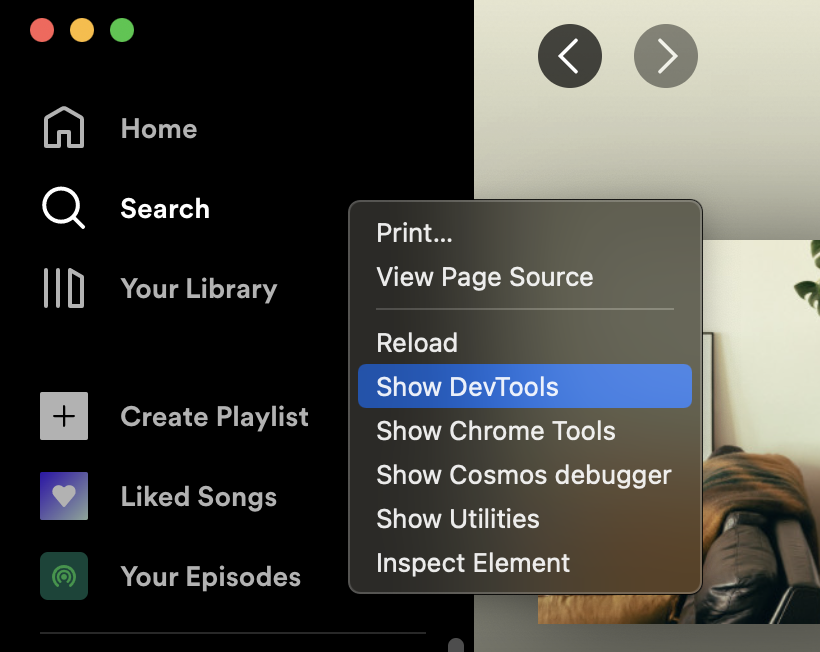

_This is a shareable version of [an X thread](https://twitter.com/iamakulov/status/1522008502398554113)._

Oh look, my favorite app Spotify being slow!

https://twitter.com/geoffreylitt/status/1521971476965969920

Also it’s 1 am meaning it’s the best time to do some performance profiling.

---

Spotify is an Electron app, meaning we can use Chrome DevTools to profile it. To enable Chrome DevTools in Spotify, I install `spicetify` and run `spicetify enable-devtools`.

Yay!



---

Now, let’s go to Chrome DevTools → Performance → Record, switch between playlists a couple times, and stop the recording. This is what we’ll get ↓

What can we see here?


---

**1\) Spotify uses React.**

This `t.unstable_runWithPriority` function in the flamechart is a key sign of React. Whenever you see it, it’s React running.

Which means it’s not surprising that switching playlists is slow! With all my love for React, it defaults into slow performance.


---

**2\) There’s not one but several React renders.**

This is likely an example of the Cascading Rerenders antipattern (gosh I should write an article on this):

- you await on several promises
- the first promise resolves → you render
- the second promise resolves → you rerender
- …


---

This is costly because:

- some components end up rerendering multiple times
- there’s on overhead of running every new React render

Once you notice this and find the cause, you typically fix this with `await Promise.all()` or `unstable_batchedUpdates()` or whatever.

---

**3\) There’s also a bunch of Layout Thrashing going on.**

All these violet rectangles take ~80 ms (out of the total ~440 ms delay). Not every one needs/can be fixed, but some definitely do!

[Can’t dive deeper into this due to a DevTools bug :( https://issues.chromium.org/issues/40835506]


---

“Layout what?” It’s great that you’re asking! Check these two great articles, my sir/madam:

- http://blog.wilsonpage.co.uk/preventing-layout-thrashing/
- https://www.phpied.com/rendering-repaint-reflowrelayout-restyle/

---

**4\) The largest React render takes 200 ms** and renders a whole lot of small components, presumably the list of tracks.

a) Why render all (checks Spotify) 82 tracks at once? Why not render just ten – and virtualize the rest?

(I’m sure there are reasons – genuinely curious!)


b) 5% of the total time is spent calling `formatDate` (presumably from `date-fns`) over and over. But there are no dates in the UI!

Mistake? Invisible component?

Or can `formatDate` be replaced with a cheaper `date.getHours()`/etc + concatenation?


---

**5\) There are styled-components!** And they’re a bottleneck here! Oh boy, this is my favorite one.

Look, so with styled-components, you write a lot of code that looks like this:

```javascript
const Button = styled.button`
  color: ${(props) => props.color};
`;
```


---

When you mount a `<Button>`, styled-components call a function called `generateAndInjestStyles()`. It generates button’s styles and injects them into `<head>`.

If you mount another `<Button>`, styled-components would reuse existing styles for perf reasons. Unless you change them!

---

What happens if you render a bunch of

```javascript
<Button color={randomColor()} />
```

?

Each button will have unique styles. styled-components will have to generate and inject separate CSS for each button. This is cheap for one button, but for 100 of them, and on every render, this adds up.

---

This is apparently what happens in Spotify (although of course with some different component).

The typical solution here is to use inline styles instead:

```javascript
<Button style={{ color: randomColor() }}>
```

---

6\) There’s a whole lot of other stuff going on in the performance pane. But with minification, it’s hard to figure out if any of it is actionable! (Also it’s 2 am so I gotta stop.)
