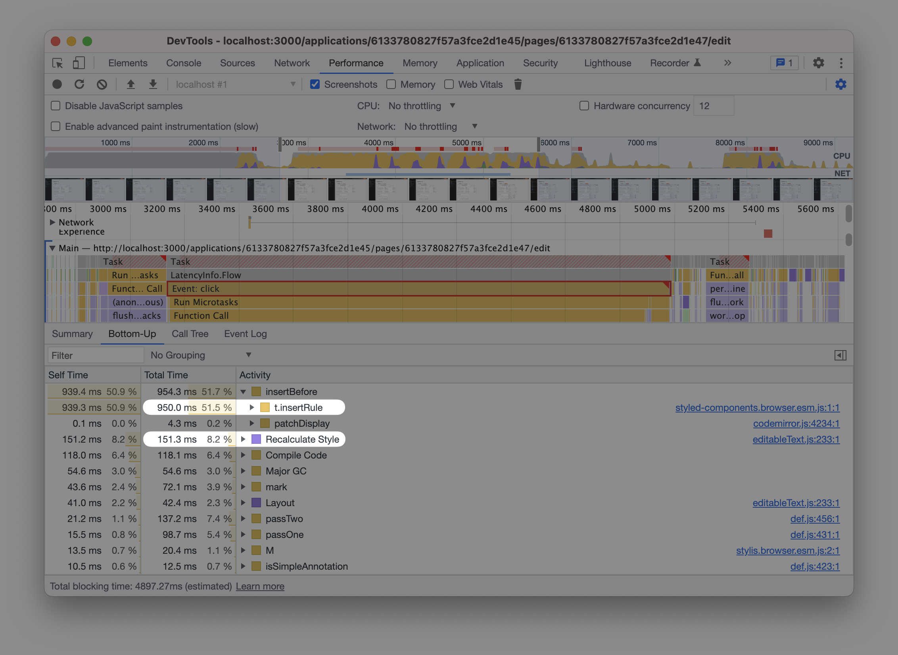

`styled-components` are a CSS-in-JS library for React. Due to their design, they can be pretty slow. E.g., here’s a performance trace from a real-world app I’m using in my performance workshops (TODO link to workshops):



In the trace, the user clicks something in the app. The click handler takes 1.8s to execute, but

- ~0.95s of that time is spent running `t.insertRule` from `styled-components`
- ~0.15s are also spent recalculating styles

```toc
# This code block gets replaced with the TOC
header: Contents
```

# Issue 1: Style Recalculations

Note: cheaper during production

# Issue 2: Parsing CSS during runtime

Link to the Web Perf Calendar article

# Issue 3: Changing props

Case: 15 KB of normalize.css

# Root issue: not fast by default

# Possible solutions

- Fix the antipatterns above
- Try to make recalcs cheaper (`content-visibility: auto`, `contain` although doubtful)
- Switch to a different approach (Linaria, what are the other libs?)

Pit of success (link to the post)

Why are `styled-components` slow?

# Other articles

- the Web Perf Calendar article

[[note]]
| **Does this mean I should ditch `styled-components` as soon as possible?** No, not necessarily. While they are slow, in most apps I work with, they aren’t the biggest performance issue.
